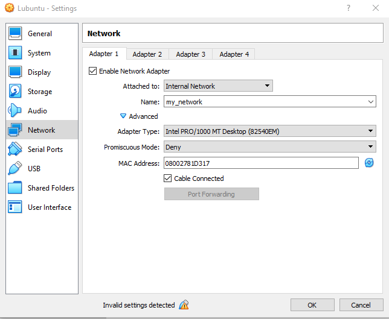
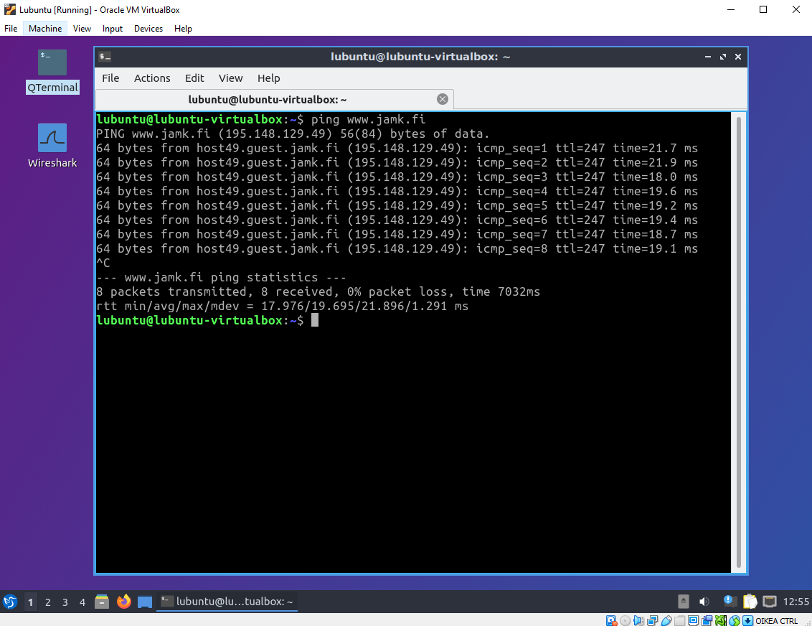
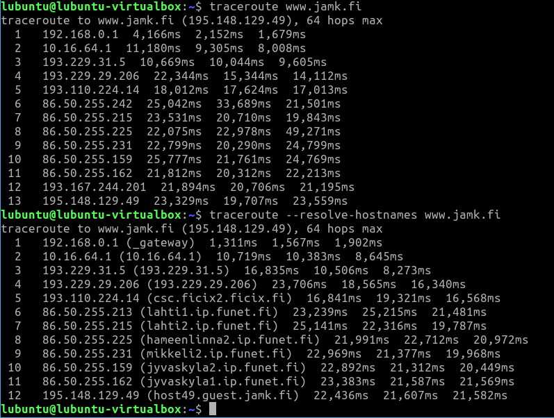
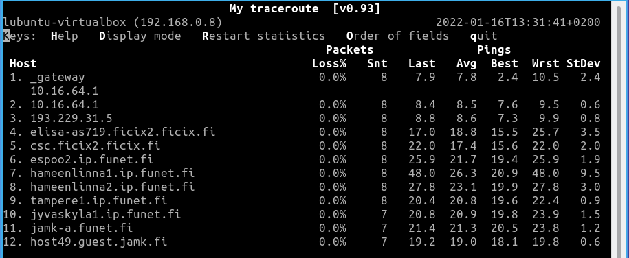
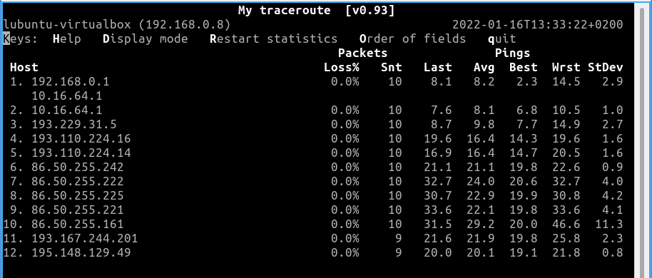

# Dokumentaatio tehtävään E01

Virtuaalikone asennettu. Toimii kuin junan vessa, voi jukupätkä!

Yritetään linkata kuvata oikein. Kokeillaan toimiiko.

Q: Mitä virtuaalikoneella voi tehdä ilman verkkoyhteyttä?
A: Käytännössä mitä tahansa, mitä voit tehdä millä tahansa tietokoneella ilman verkkoyhteyttä.
EsimerkiksiTestaamaan käyttöjärjestelmän ominnaisuuksia, katsomaan kuvia ja videoita, kuuntelemaan musiikkia ja niinedelleen. Tekemään sellaisia töitä, joihin ei tarvitse internet -yhteyttä, kuten esimerkiksi kirjoittamaan dokumentteja, editoimaan kuvia ja videoita.

Q: Onko tietokoneilla mitään tarkoitusta ilman yhteyttä tietoverkkoon.
A: On varmasti. Itselläni ensimmäisenä tulee mieleen, että pystyy vaikka käyttämään erilasia apuohjelmia tai pelamaan vaikka tietokonepelejä.

Virtuaalikoneella käytetty ping www.jamk.fi. Lisätty kuva E01 -kansioon.

Kokeiltu traceroute ja traceroute --resolve -komentoja. Lisätään kuvat kansioon ja kokeillaan myös linkata tähän.

Kokeiltu mtr -komentoja. Lisätään kuvat kansioon ja kokeillaan linkata kuvat myös tähän.

