# Dokumentaatio tehtävään E02

Aloita tästä...

Kytkinten konfiguraatiot

* [Switch1](/E02/Switch.cfg)

Tehty kuva draw.io:lla verkkotopologiasta
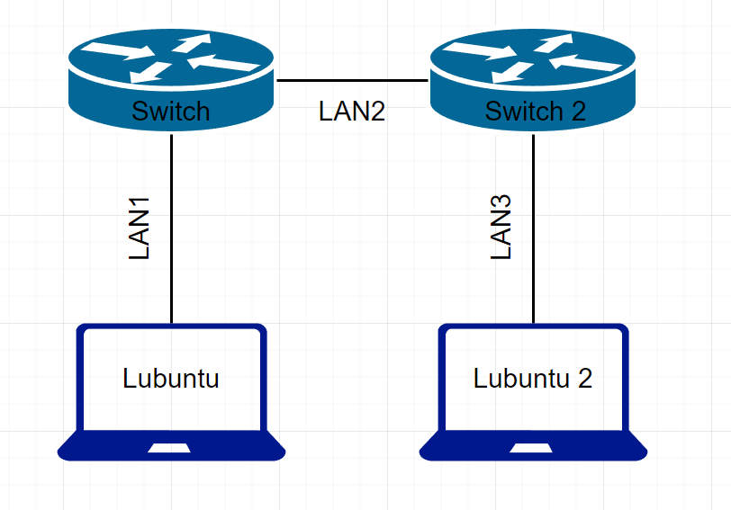

Lisäksi lisätty alle kuvat kummastakin lubuntun koneesta

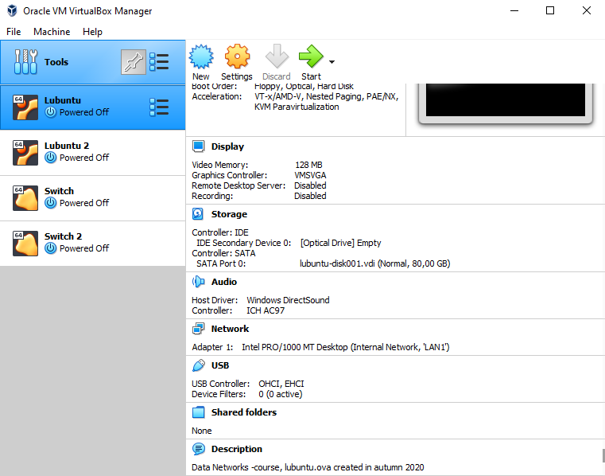
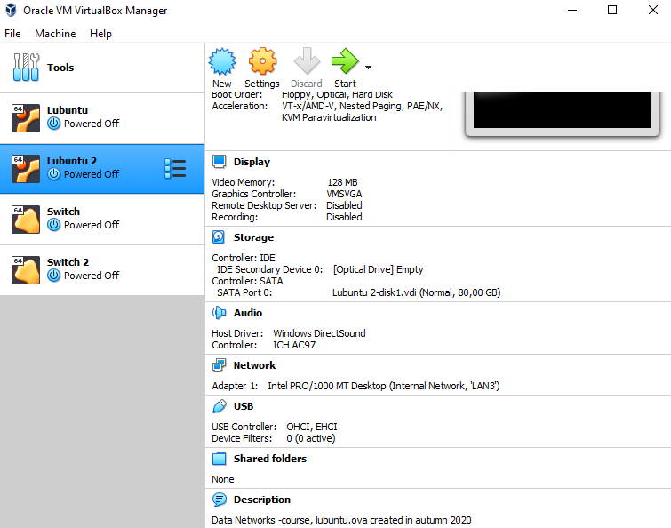

ja kummastakin kytkimestä

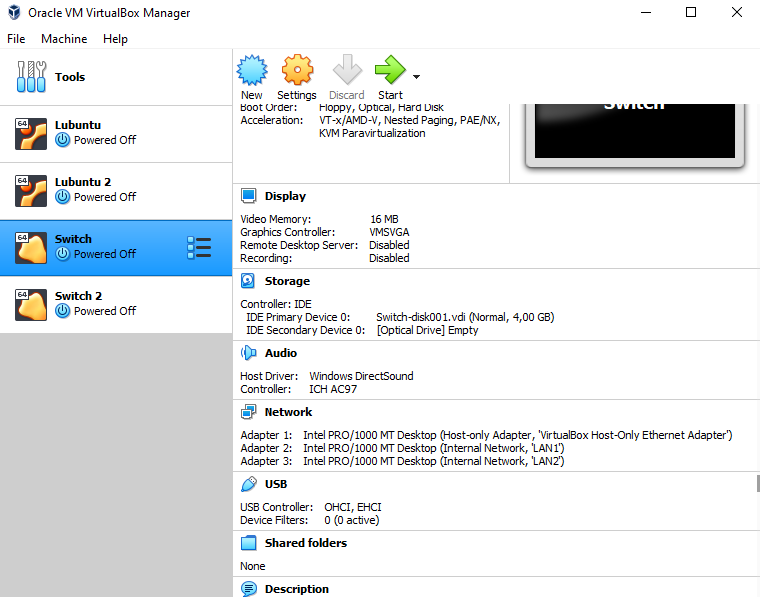
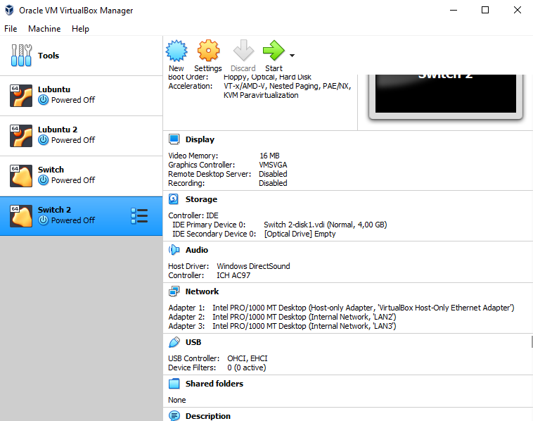

Seuraavaksi lisään kuvia, kun katson lubuntujen porttien infoja, configuraatioita ja ip -osoitteita. Päivitetty kuva porttien infosta.

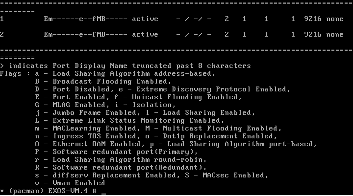
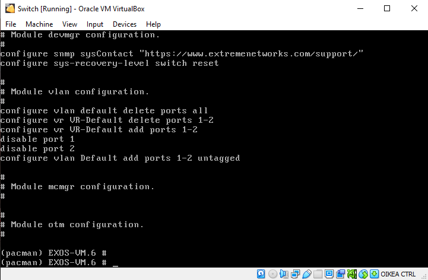
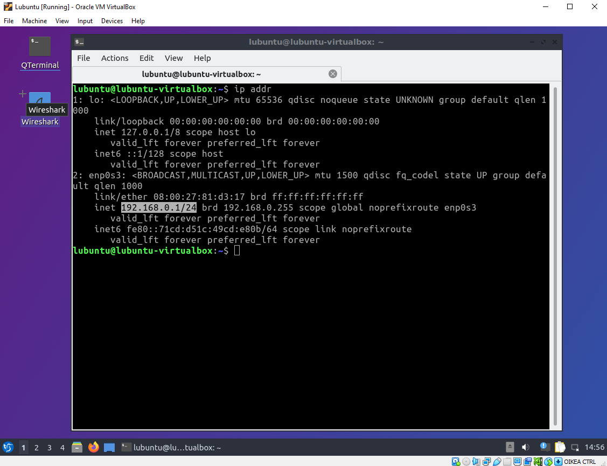
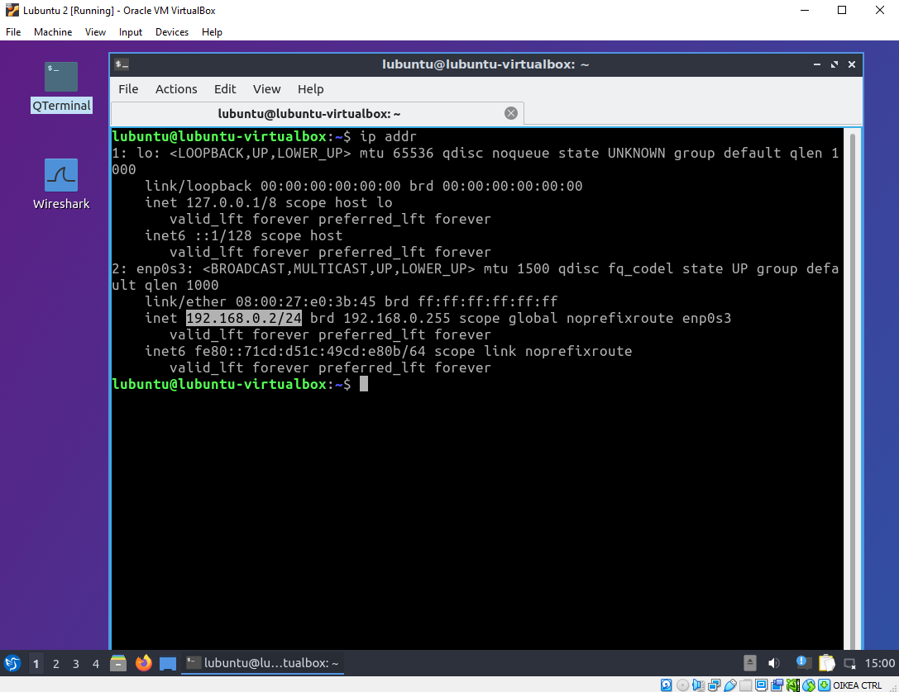

Huomasin, etten ollut aukaissut kummastakin kytkimestä portteja auki, joten pingaus ei toiminut. Nyt alapuolella kuva, kun pingaus toimii.

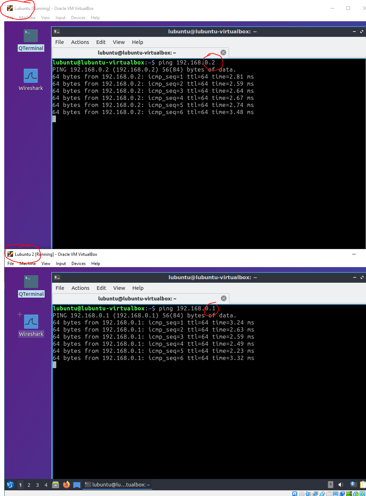

Seuraavaksi kuva fdb -komennoista.
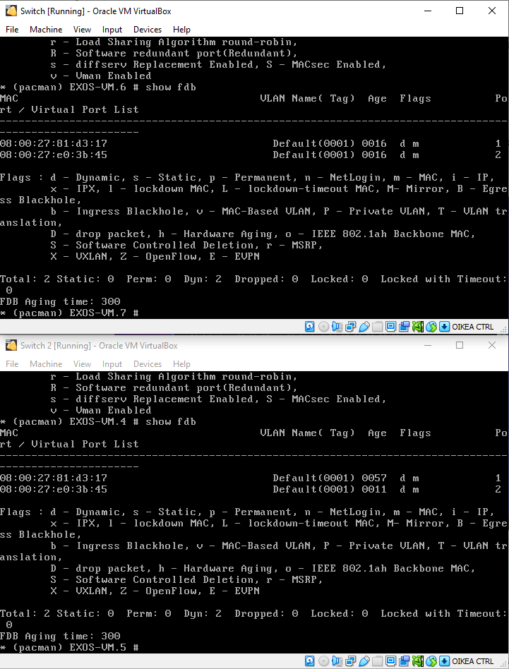

Oli suurensuuria ongelmia saada wiresharkkia toimimaan, eihän siihen mennyt kuin pari kokonaista päivää.. mutta nyt toimii!

Kuva wiresharkin toimivuudesta:
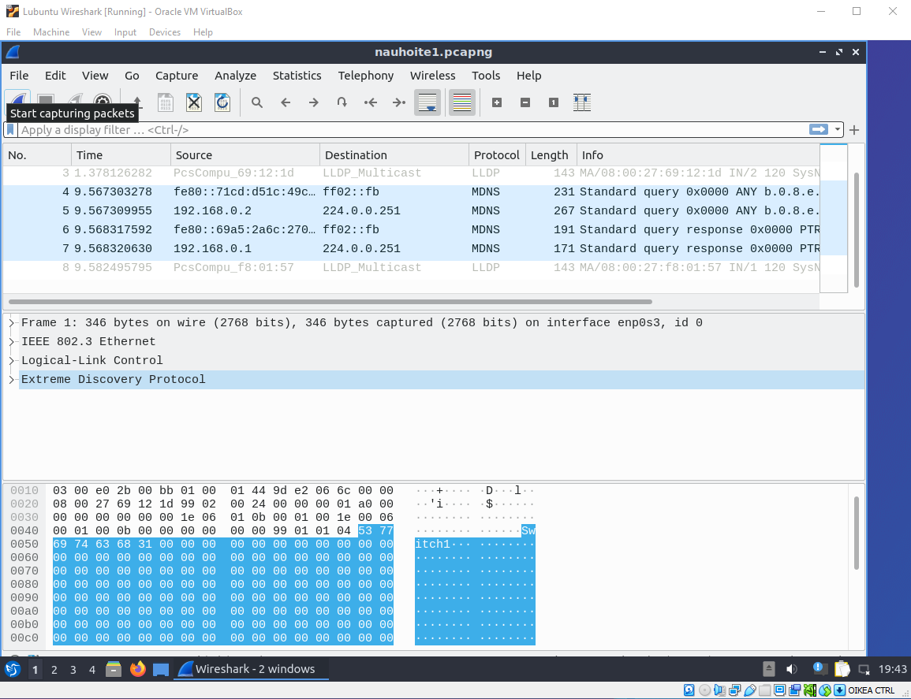

Huh ja huh, olipahan työmaa, mutta nyt on ihmisen hyvä olla kun sai tehtyä nämä! toivottavasti ei takkuaisi samalla tavalla seuraavissa tehtävissä.

### <ins> Kytkimien konfiguraatiot:

* [Switch1](E02/Switch1.cfg) 
* [Switch2](E02/Switch2.cfg)