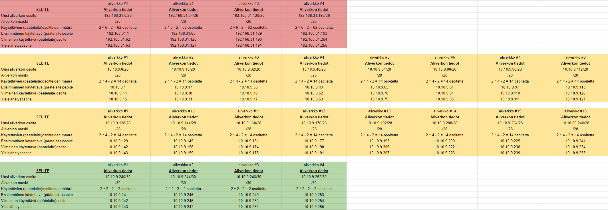
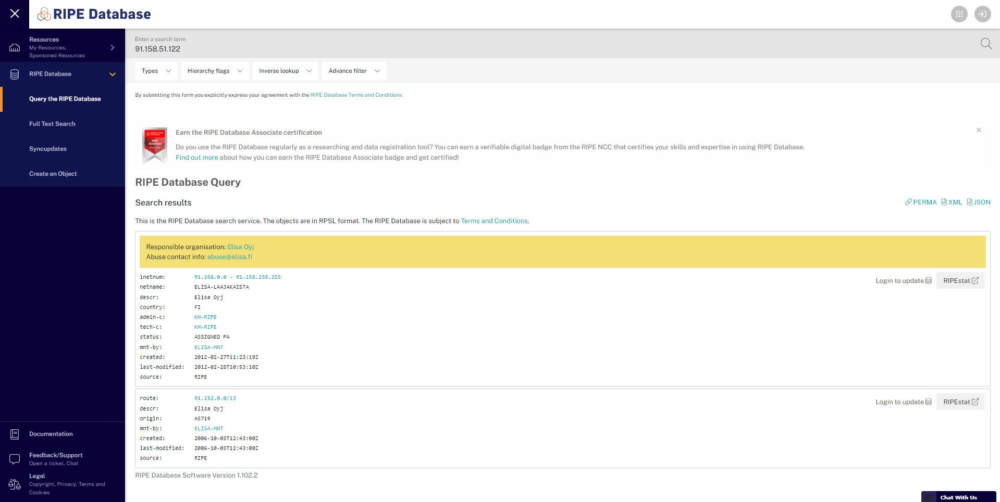
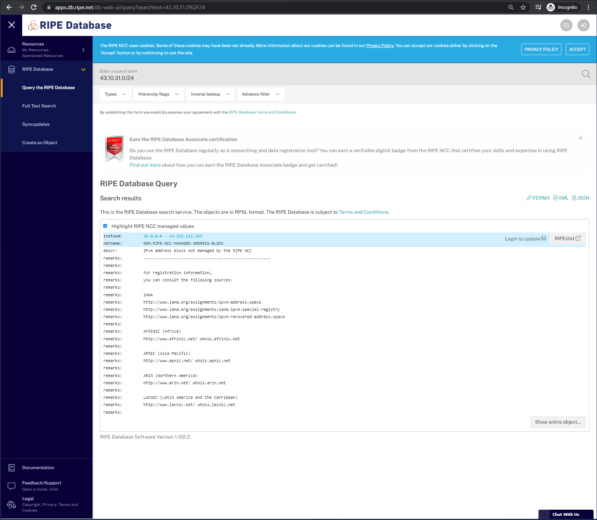
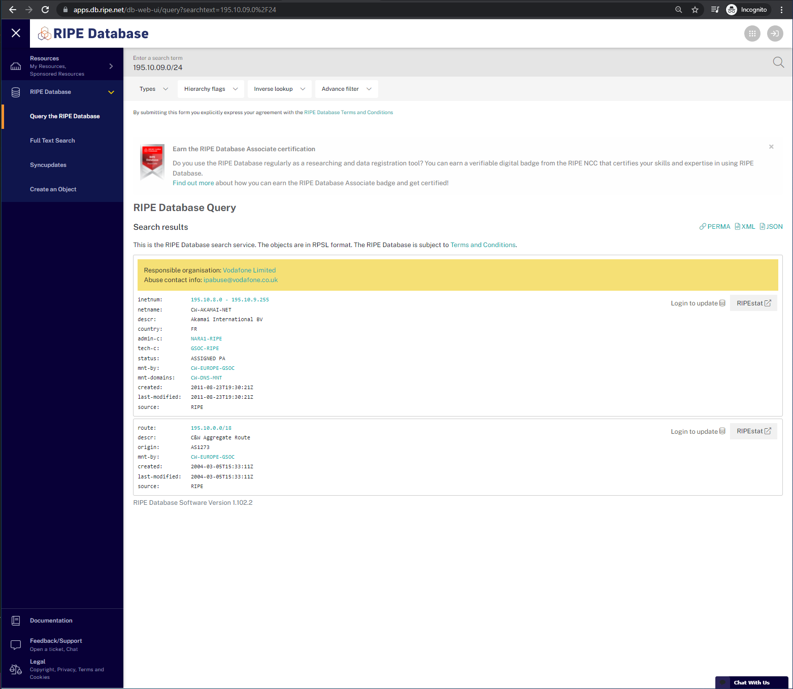
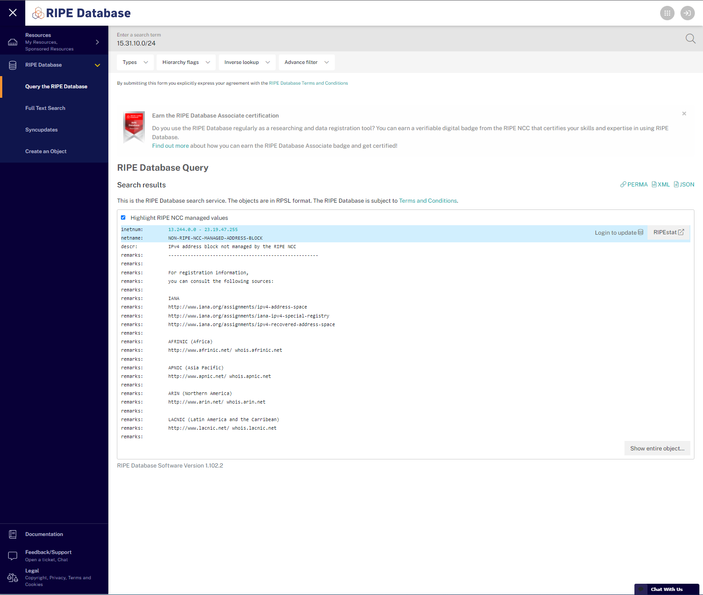
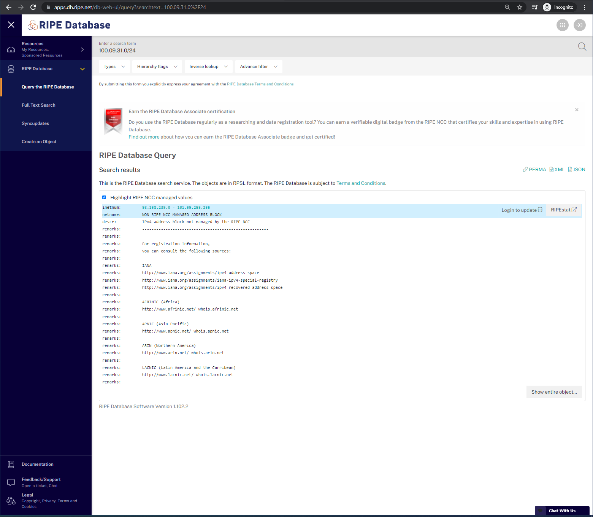

# Dokumentaatio tehtävään E03

Opiskelijanumero: 2110931
~~~~
vvxyzki

2110931
~~~~

Käytä opiskelijanumeroasi ja muodosta seuraavat aliverkot: 10.xy.yz.0/24 and 192.168.ki.0/24
~~~~
Omat aliverkot
10.10.09.0/24
192.168.31.0/24
~~~~

Tässä on aukikirjoitettua muistiinpanoa itselleni, kun video -walkthrough:n kanssa tätä tehtävää.
/24    "slash" -formaatissa aliverkon maski
        "binääri" -formaatissa aliverkon maski (BIN)
1111 1111 . 1111 1111 . 1111 1111 . 0000 0000  <- IPv4 32bit osoite
nnnn nnnn . nnnn nnnn . nnnn nnnn . hhhh hhhh  <- n=network bit, h=host bit)

        "decimal" -formaatissa aliverkon maski (DEC, kokonaisluku)
255       .     255   .     255   .     0

---

## <ins>Harjoitus 1

Mikä on 192.168.31.0/24:n käytettävä osoiteavaruus (päätelaitteille)? 

**<ins>Vastaus:** Osoiteavaruuutta 192.168.31.0/24 -aliverkossa on
    192.168.31.0 - 192.168.31.255 välillä

    Huom! IPv4:ssä ei saa käyttä työasemille verkonosoitetta tai broadcast -osoitetta.
        -> työasemat/ppäätelaitteet voivat käyttää 192.168.31.1 - 192.168.31.254
        2^8 - 2 = 254 päätelaiteosoitetta 

Mikä on kyseisen verkon yleislähetysosoite? (eng. Broadcast address) 

192.168.31.255    (Osoite, jossa kaikki h -bitit ovat ykkösiä)

Mikä on verkon osoite? (eng. Subnet Address)

**<ins>Vastaus:** 192.168.31.0    (Osoite, jossa kaikki h - bitit ovat nollia)

---

## <ins>Harjoitus 2

Jaa 192.168.31.0/24 pienemmiksi aliverkoiksi, johon mahtuu vähintään 50 päätelaitetta. Huom! Tee mahdollisimman pieni aliverkko!

2^6 - 2 = 62 osoitetta <- Onnistuu siis kuudella bitillä, joten vähennetään kaksi host -bittiä.

/26 <- slash formaatti, kuvastaa alapuolella olevien ykkösten lukumäärää
~~~~
1111 1111 . 1111 1111 . 1111 1111 . 1100 0000
nnnn nnnn . nnnn nnnn . nnnn nnnn . nnhh hhhh
~~~~
255       .    255    .    255    .    192

~~~~
0000 0000	0
0000 0001	1
0000 0010	2
0000 0011	3
0000 0100	4
0000 0101	5
...	
1111 1100	252
1111 1101	253
1111 1110	254
1111 1111	255
~~~~

ALIVERKKOJA 6:lla h-bitillä

**<ins>HUOM!** Aliverkkojen määrän saa laskettua kaavalla: 2 ^ n

1100 0000
nnhh hhhh

2 ^ 2 = 4 aliverkkoa

		
aliverkko #1	

    00|00 0000	0       <- Verkon osoite
    00|00 0001	1      
    00|00 0010	2
    00|00 0011	3
		
    00|11 1100	60
    00|11 1101	61
    00|11 1110	62     
    00|11 1111	63      <- Broadcasting -osoite

aliverkko #2	

    01|00 0000	64      <- Verkon osoite
	01|00 0001	65     
	01|00 0010	66
	01|00 0011	67
	01|00 0100	68
		
    01|11 1100	124
	01|11 1101	125
	01|11 1110	126
	01|11 1111	127     <- Broadcasting -osoite
		
aliverkko #3	

    10|00 0000	128     <- Verkon osoite
	10|00 0001	129     
	10|00 0010	130
	10|00 0011	131
	10|00 0100	132
		
    10|11 1100	188
	10|11 1101	189
	10|11 1110	190
	10|11 1111	191     <- Broadcasting -osoite

aliverkko #4

    11|00 0000	192     <- Verkon osoite
	11|00 1101	193    
	11|00 1110	194
	11|00 1111	195
		
    11|11 1100	252
	11|11 1101	253
	11|11 1110	254
	11|11 1111	255     <- Broadcasting -osoite

---

## <ins>Harjoitus 3

Jaa 10.xy.yz.0/24 pienemmiksi aliverkoiksi, johon mahtuu vähintään 13 päätelaitetta. Huom! Tee mahdollisimman pieni(ä) aliverkko(ja):

Täytä Aliverkon tiedot sarake tiedoillasi. Jos verkkoja tulee useampia, lisää sarakkeita.

2 ^ 4 = 16
16 - 2 = 14 laitetta | ok, tällä mennään

ALIVERKKOJA 4:lla h-bitillä

1111 0000
nnnn hhhh

2 ^ n -> 2 ^ 4 = 16 aliverkkoa (voi pojat, no ei muuta kuin tekemään)

aliverkko #1	

    0000|0000	0       <- Verkon osoite
	0000|0001	1       
	0000|0010	2
	0000|0011	3
		
	0000|1100	12
	0000|1101	13
	0000|1110	14
    0000|1111	15      <- Broadcasting -osoite

aliverkko #2	

    0001|0000	16       <- Verkon osoite
	0001|0001	17
	0001|0010	18
	0001|0011	19
		
	0001|1100	28
	0001|1101	29
	0001|1110	30
    0001|1111	31      <- Broadcasting -osoite

aliverkko #3	

    0010|0000	32       <- Verkon osoite
	0010|0001	33
	0010|0010	34
	0010|0011	35
		
	0010|1100   44
	0010|1101	45
	0010|1110	46
    0010|1111	47      <- Broadcasting -osoite

aliverkko #4	

    0011|0000	48       <- Verkon osoite
	0011|0001	49
	0011|0010	50
	0011|0011	51
		
	0011|1100   60
	0011|1101	61
	0011|1110	62
    0011|1111	63      <- Broadcasting -osoite

aliverkko #5	

    0100|0000	64       <- Verkon osoite
	0100|0001	65
	0100|0010	66
	0100|0011	67
		
	0100|1100   76
	0100|1101	77
	0100|1110	78
    0100|1111	79      <- Broadcasting -osoite

aliverkko #6	

    0101|0000	80       <- Verkon osoite
	0101|0001	81
	0101|0010	82
	0101|0011	83
		
	0101|1100   92
	0101|1101	93
	0101|1110	94
    0101|1111	95      <- Broadcasting -osoite

aliverkko #7	

    0110|0000	96       <- Verkon osoite
	0110|0001	97
	0110|0010	98
	0110|0011	99
		
	0110|1100   108
	0110|1101	109
	0110|1110	110
    0110|1111	111      <- Broadcasting -osoite

aliverkko #8	

    0111|0000	112       <- Verkon osoite
	0111|0001	113
	0111|0010	114
	0111|0011	115
		
	0111|1100   124
	0111|1101	125
	0111|1110	126
    0111|1111	127      <- Broadcasting -osoite

aliverkko #9	

    1000|0000	128       <- Verkon osoite
	1000|0001	129
	1000|0010	130
	1000|0011	131
		
	1000|1100   140
	1000|1101	141
	1000|1110	142
    1000|1111	143      <- Broadcasting -osoite

aliverkko #10	

    1001|0000	144       <- Verkon osoite
	1001|0001	145
	1001|0010	146
	1001|0011	147
		
	1001|1100   156
	1001|1101	157
	1001|1110	158
    1001|1111	159      <- Broadcasting -osoite

aliverkko #11	

    1010|0000	160       <- Verkon osoite
	1010|0001	161
	1010|0010	162
	1010|0011	163
		
	1010|1100   172
	1010|1101	173
	1010|1110	174
    1010|1111	175      <- Broadcasting -osoite

aliverkko #12	

    1011|0000	176       <- Verkon osoite
	1011|0001	177
	1011|0010	178
	1011|0011	179
		
	1011|1100   188
	1011|1101	189
	1011|1110	190
    1011|1111	191      <- Broadcasting -osoite

aliverkko #13	

    1100|0000	192       <- Verkon osoite
	1100|0001	193
	1100|0010	194
	1100|0011	195
		
	1100|1100   204
	1100|1101	205
	1100|1110	206
    1100|1111	207      <- Broadcasting -osoite

aliverkko #14	

    1101|0000	208       <- Verkon osoite
	1101|0001	209
	1101|0010	210
	1101|0011	211
		
	1101|1100   220
	1101|1101	221
	1101|1110	222
    1101|1111	223      <- Broadcasting -osoite

aliverkko #15	

    1110|0000	224       <- Verkon osoite
	1110|0001	225
	1110|0010	226
	1110|0011	227
		
	1110|1100   236
	1110|1101	237
	1110|1110	238
    1110|1111	239      <- Broadcasting -osoite

aliverkko #16	

    1111|0000	240       <- Verkon osoite
	1111|0001	241
	1111|0010	242
	1111|0011	243
		
	1111|1100   252
	1111|1101	253
	1111|1110	254
    1111|1111	255      <- Broadcasting -osoite

## harjoitus 4

Jaa viimeinen aliverkko harjoituksesta 3 pienemmiksi aliverkoiksi, johon mahtuu vähintään 2 päätelaitetta. Huom! Tee mahdollisimman pieni(ä) aliverkko(ja):

Täytä Aliverkon tiedot sarake tiedoillasi. Jos verkkoja tulee useampia, lisää sarakkeita.

2 ^ 2 = 4
4 - 2 = 2 laitetta | ok, tällä mennään

Tästä jatketaan sitten myöhemmin lisää :) tällä kertaa voisin laittaa kaikille aliverkoille vain
verkon osoitteen, broadcast -osoitteen, ensimmäisen ja viimeisen käytettävän laitteen osoitteet.

Tein tätä varten excel -taulukon itselleni. Linkkaan alapuolelle kuvan, joka löytyy myös E03 -kansiosta kuvana.
Kuvassa on harjoitus 2-4 aliverkot taulukoituna. Punainen väri harjoitus 2, keltainen harjoitus 3 ja vihreä harjoitus 4.

Jouduin tulemaan tänne korjaamaan tämän tehtävän, kun huomasin vasta paljon myöhemmin tehneeni tämän kyseisen kohdan väärin. Nyt sitten korjauspäivitys tähänkin kohtaan :)

---

## Harjoitus 5

Onko aliverkko 10.10.09.0/24 osa suurempaa verkkoa 10.10.16.0/20? Kirjoita laskelmasi paperille tai tee ne tietokoneella. 

Lisää laskelmat dokumentaatioon (esim. ota kuva paperista tai kuvankaappaus tietokoneelta)
~~~
hhhh . hhhh hhhh
0000 . 0000 0000    -> verkon osoite kaikki nollia -> 0.0 (DEC)
1111 . 1111 1111    -> broadcast osoite kaikki ykkösiä -> 15.255

/20 -> maski kertoo verkon koon
nnnn nnnn . nnnn nnnn . nnnn hhhh . hhhh hhhh 
1111 1111 . 1111 1111 . 1111 0000 . 0000 0000 (maski binäärinä)

10.10.16.0 maskia käytetään annettuun arvoon
0000 1010 . 0000 01010 . 0001 0000 . 0000 0000 (annettu osoite binäärinä)

	TÄÄLLÄ ON VERKON PUOLI		| TÄÄLLÄ ON HOST LAITTEIDEN PUOLI

	0000 1010 . 0000 01010 . 0001 | hhhh . hhhh hhhh    10.10.16.0/20
	0000 1010 . 0000 01010 . 0001 | 0000 . 0000 0000 -> 10.10.16.0
							......						-
	0000 1010 . 0000 01010 . 0001 | 1111 . 1111 1111 -> 10.10.31.255
~~~
													
10.10.09.0/24 -> **<ins>Vastaus:** Ei ole osoitteiden välissä.

---

## <ins>Harjoitus 6

Onko aliverkko 10.10.09.0/24 osa suurempaa verkkoa 10.0.0.0/8? Kirjoita laskelmasi paperille tai tee ne tietokoneella. 

Lisää laskelmat dokumentaatioon (esim. ota kuva paperista tai kuvankaappaus tietokoneelta)

~~~
/8 -> maski kertoo verkon koon
nnnn nnnn . hhhh hhhh . hhhh hhhh . hhhh hhhh
1111 1111 . 0000 0000 . 0000 0000 . 0000 0000 (maski binäärinä)

10.0.0.0 maskia käytetään annettuun arvoon
0101 . 0000 . 0000 . 0000 (annettu osoite binäärinä)

	VERKKO	  | HOST LAITTEET

	0000 1010 | 0000 0000 . 0000 0000 . 0000 0000    10.0.0.0/8 
	0000 1010 | 1111 1111 . 1111 1111 . 1111 1111	10.255.255.255
~~~

<ins>**Vastaus:**</ins> 10.10.09.0/24 on osoitteiden välissä.

---

## <ins>Internetin rekisterinpitäjät

Your IP address is: 91.158.51.122

Laitoin ip -osoitteen hakupalkkiin, tässä siitä kuva

vvxyzki
2110931

	Täytä osoitteet tiedoillasi: 
	195.xy.yz.0/24 -> 195.10.09.0/24,
	43.xy.ki.0/24  -> 43.10.31.0/24,
	15.ki.xy.0/24  -> 15.31.10.0/24,
    100.yz.ki.0/24 -> 100.09.31.0/24

Kenelle ne on rekisteröity? Etsi RIR:t lävitse:

Alla olevien kuvien tarkistukset RIPE:n kautta

