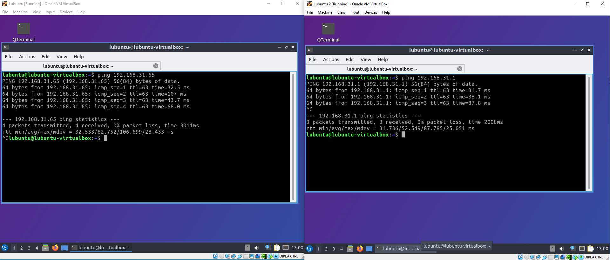

# Dokumentaatio tehtävään E04

Harkkaa aloiteltu, tehty step-by-step -walkthrough kanssa. On hirvittävän mieluista tehdä harjoituksia tällä tavalla, oppii vähintään yhtä hyvin ellei jopa paremmin kuin ilman näitä walkthrough -videoita.

Vyosia tuli jo konfailtua, mutta unohdin tietysti dokumentoita.. laitan jossain kohtaa niistä kuvaa ja/tai tekstiä että ovat kunnossa. Laitetaan nyt alkuun kuitenkin vähän piirrustuksia sekä fyysisistä että loogisista topologioista. Tuli päiviteltyä näitäkin kuvia, mm. oikeat ip -osoitteet kumpaankin topologiaan.

Kytkimiä confailtu hieman uudestaan: luotu uusi workstation, tagin numero ja portit tagattu / untagattu oikein (toivottavasti). Tähän kohtaan kuvia kytkimien configuraatioista, voi jukupätkä!
Päivitin switch2:n configuraatioita, oli jäänyt yksi tagged -komento laittamatta.

Noniin, harjoitus etenee mukavasti. Nyt on vyos:ia configuroitu. Laitellaanpas siitäkin kuvaa. Lisätään toinenkin kuva vyosin konfiguraatiosta, josta näkee ip -osoitteet ja kuvaukset kullekin interfacelle.

Pienen hankaluuden jälkeen päästiin viimeistäkin vaihetta tekemään. Eli switchien ja vyosin configurointia tuli tehtyä jonkin verran.. lopuksi sitten kuvia configoinneista ja pingauksista tehtävänannon mukaisesti (lubuntu -> lubuntu, lubuntu -> switch, lubuntu -> vyos,)

Switchien confia. Lisätty network_devices tagin kanssa. Vasemmalla switch ja oikealla switch2. Täydellinen konfiguraatio erillisenä.

Tässä kuvia kummankin lubuntun pinggauksista. Vasemmalla lubuntu, oikealla lubuntu2.

---

Tästä nyt jäi vielä uupumaan ne kytkimien configuraatiot.. ssh -yhteyttä ottaessa herjaa että "port 22: connection refused".

Noniin, olin siis unohtanut kytkimiä luodessa tallentaa configuraatiot, kun käytin "enable ssh2 port 22" -komentoa. Siksihän se ei antanut tietenkään minun päästä purkkiin sisälle. Mutta nyt alapuolella konfiguraatiot purkeista.

### <ins>Laitteiden konfiguraatiot:

* [vyos](E04/vyos.cfg)
* [switch](E04/switch.cfg)
* [switch2](E04/switch2.cfg)