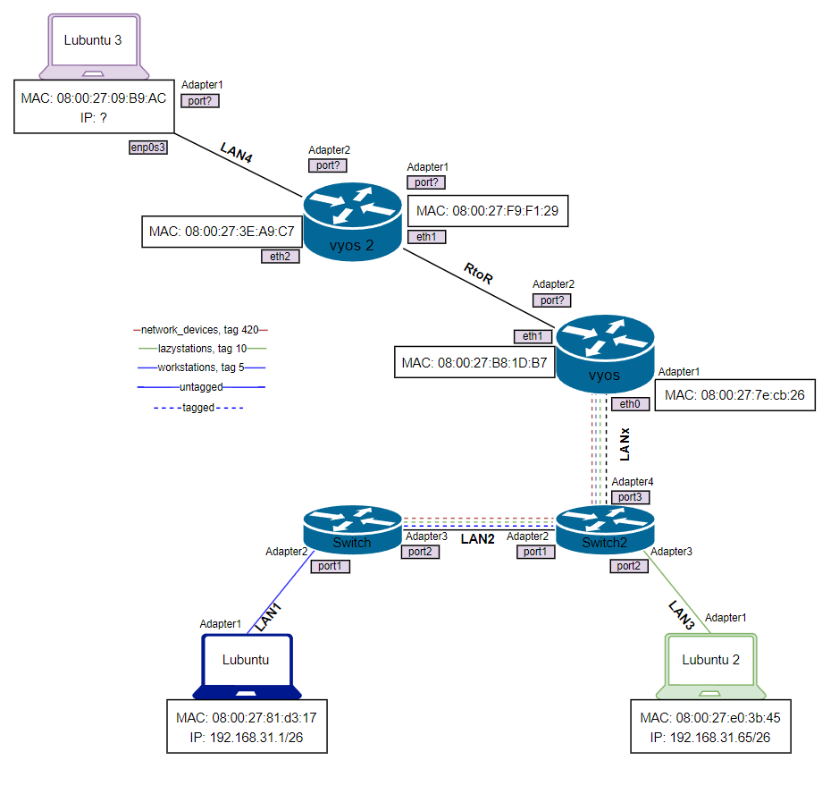
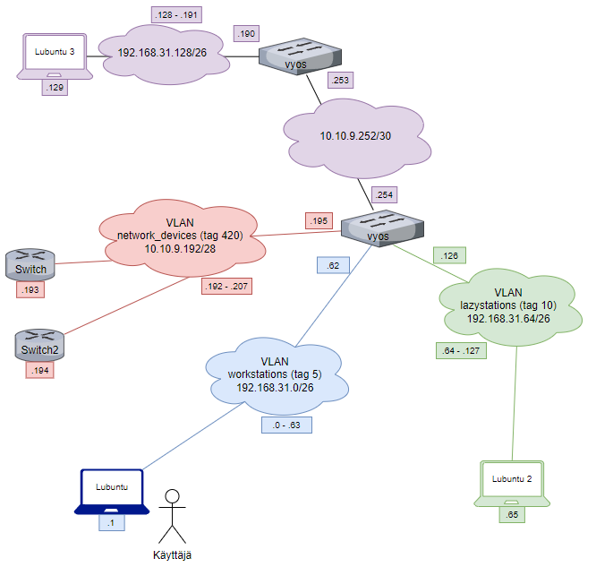
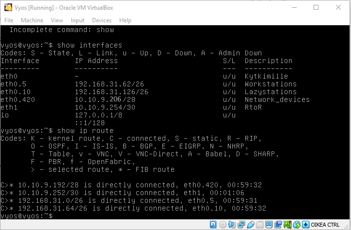
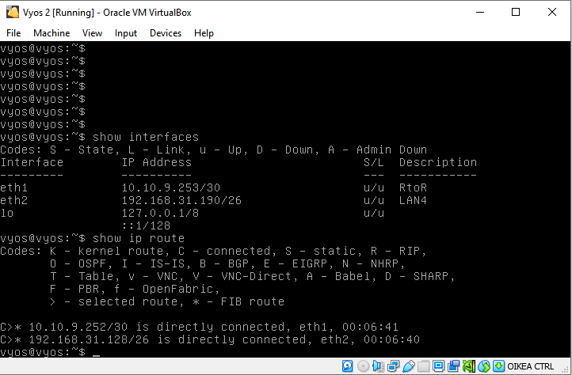
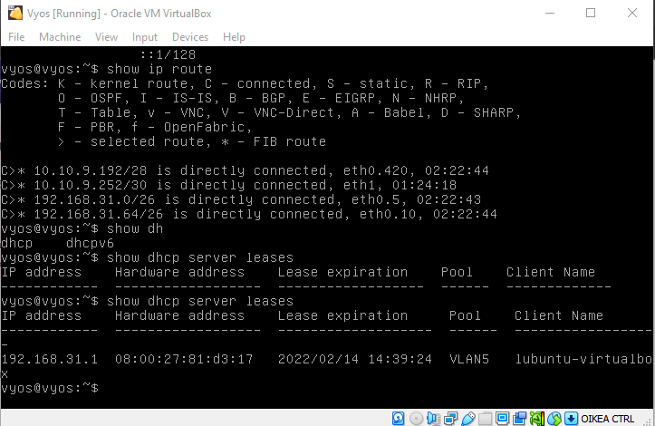
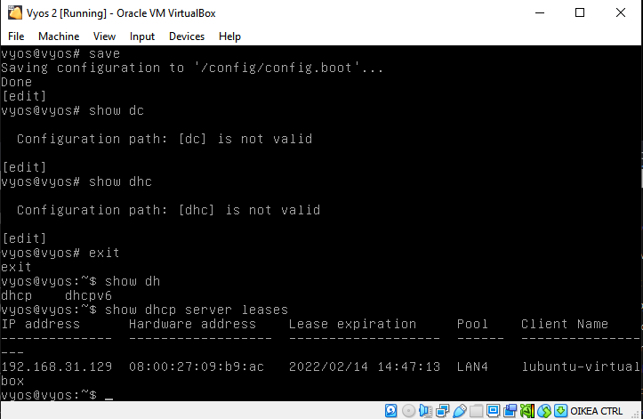
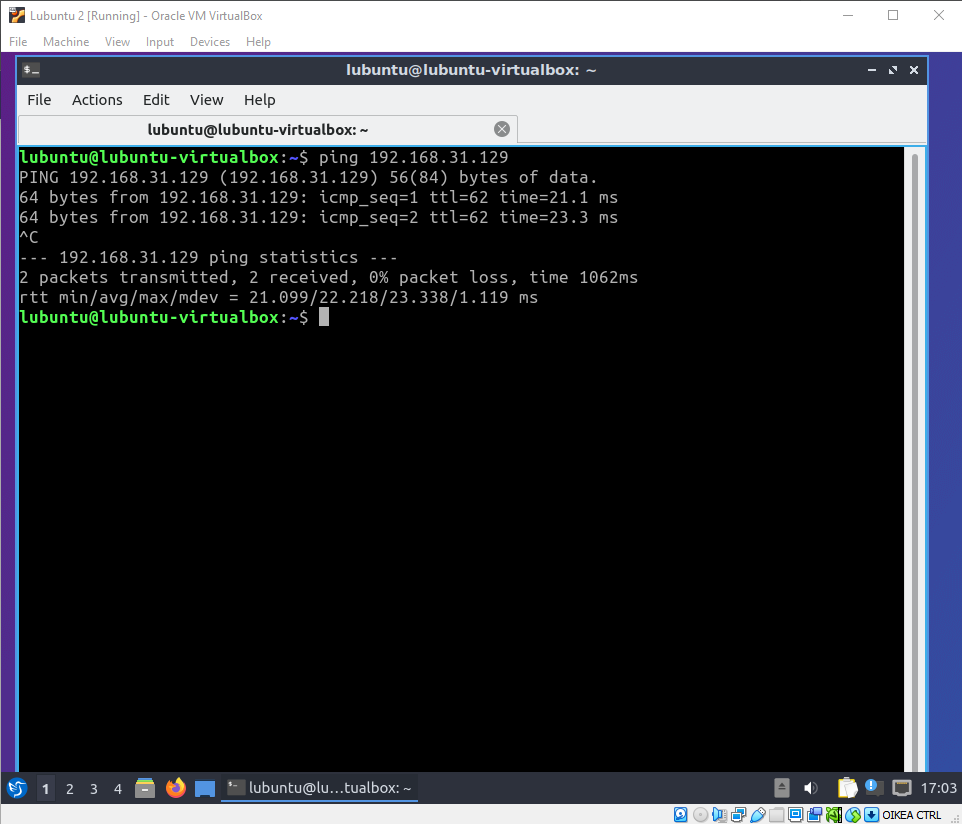

# Dokumentaatio tehtävään E05

Jeps, harkkaa aloiteltu jälleen step-by-step -videon kanssa. Voi jukupätkä nämä on hianoja kun voi videon avustuksella tehdä asioita.

Mutta, asiaan. Satuinpa heti huomaamaan videosta, että olin tehnyt E03 - harjoitus 4 kohdan vähän väärin, kun olin aliverkottanut verkkoja kahdeksalle laitteelle (verkon maski /29), enkä neljälle laitteelle (verkon maski /30). Päivitän nämä kuntoon tuonne aiempaan harjoitukseen.

### <ins>Staattinen reititys
~~~
Käytä kolmatta 50 (päätelaite)osoitteen aliverkkoa (E03 Aliverkkojen laskenta - Harjoitus 2) R2:sen ja Lubuntu3 välillä.

Käytä yksi 2 (päätelaite)osoitteen aliverkko (E03 Aliverkkojen laskenta - Harjoitus 4) R1 ja R2 välillä.
~~~
Loin uuden vyosin, lubuntun. Otin laitteilta MAC -osoitteet talteen ja päivitin fyysiseen topologiaan MAC -osoitteita, adaptereiden ja verkkojen nimiä. Tein myös päivityksiä loogisen topologian puolelle, joten laitetaanpas hieman kuvia päivityksistä.

Toista vyos:ia on configuroitu, laiteaanpa siitäkin kuva.

Kuva myös toisen vyos:in konfiguraatiosta.

### <ins>DHCP Reitittimillä

Lisää ja dokumentoi DHCP palvelin(konfiguraatio) R1:ssä kiinni oleville aliverkoille (paitsi network_devices)

~~~~
- set service dhcp-server shared-network-name VLAN5 subnet 192.168.0.0/24 default-router 192.168.0.254 <- oletusyhdyskäytävä komento

- set service dhcp-server shared-network-name VLAN5 subnet 192.168.0.0/24 range PCs start 192.168.0.2 <- mistä osoitteita ruvetaan jakelemaan

- set service dhcp-server shared-network-name VLAN5 subnet 192.168.0.0/24 range PCs stop 192.168.0.250 <- mihin osoitteiden jako päätetään
~~~~

### <ins>Staattinen reititys

Annetaan vyos -laitteille staattisen reitityksen komennot. Vyos1 -laitteen komento topologian mukaisesti on seuraava:

~~~~
- set protocols static route 192.168.31.128/26 next-hop 10.10.9.253
~~~~

ja vastaavasti Vyos2 -laitteen komennot topologian mukaisesti ovat seuraavat:

~~~~
- set protocols static route 192.168.31.0/26 next-hop 10.10.9.254
- set protocols static route 192.168.31.64/26 next-hop 10.10.9.254
~~~~

### <ins>Vyos

### Configuraatiot VLAN:lle workstations (192.168.31.0/26)

~~~~
set service dhcp-server shared-network-name VLAN5 subnet 192.168.31.0/26 default-router 192.168.31.62

set service dhcp-server shared-network-name VLAN5 subnet 192.168.31.0/26 range PCs start 192.168.31.1

set service dhcp-server shared-network-name VLAN5 subnet 192.168.31.0/26 range PCs stop 192.168.31.50
~~~~

### <ins>Configuraatiot VLAN:lle lazystations (192.168.31.64/26)
~~~~
set service dhcp-server shared-network-name VLAN10 subnet 192.168.31.64/26 default-router 192.168.31.126

set service dhcp-server shared-network-name VLAN10 subnet 192.168.31.64/26 range PCs start 192.168.31.65

set service dhcp-server shared-network-name VLAN10 subnet 192.168.31.64/26 range PCs stop 192.168.31.115
~~~~

## Vyos 2

### <ins>Configuraatiot LAN4 (192.168.31.128/26)

~~~~
set service dhcp-server shared-network-name LAN4 subnet 192.168.31.128/26 default-router 192.168.31.190

set service dhcp-server shared-network-name LAN4 subnet 192.168.31.128/26 range PCs start 192.168.31.129

set service dhcp-server shared-network-name LAN4 subnet 192.168.31.128/26 range PCs stop 192.168.31.179
~~~~
Voi jukupätkä! Otin manuaalisesti laitetun ip -osoitteen lubuntulta pois, pistin tilalle automatisoidun DHCP -osoitteen ja kokeilin vyos:in kautta show dhcp server leases -komentoa. Sehän toimi! tässä kuva siitä:

Sain pingin toimimaan lubuntu2 -koneelta lubuntu3 -koneeseen, voi jukupätkä! kuva siitäkin todisteeksi. Kyllä elämä hymyilee.

Jee, nyt sain lopultakin configuraatioita otettua talteen. En ollut kytkimiä tehdessä muistanut tallentaa "enable ssh2 port 22" -komentoa, joten en saanut aluksi konfiguraatioita niistä talteen. Mutta nyt alapuolella kaikkien laitteiden configuraatiot:

* [vyos](E05/vyos.cfg)
* [switch](E05/switch.cfg)
* [switch2](E05/switch2.cfg)