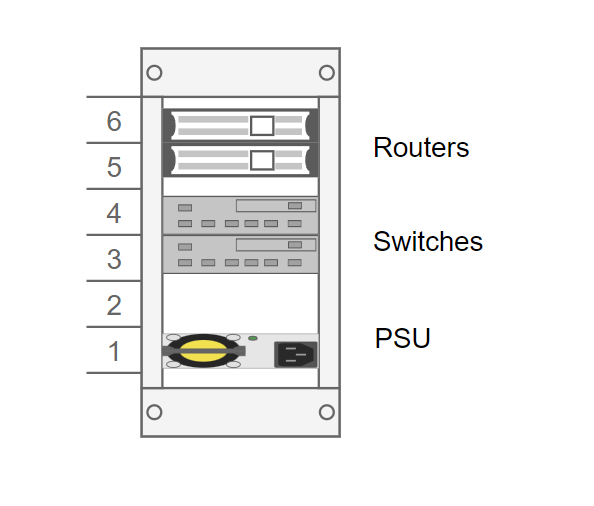

# Dokumentaatio tehtävään E06

Harkkaa aloiteltu. Tarkoitsella viivästytin harkan tekoa, että sain tehtyä muita tehtäviä. Nyt kuitenkin työstetään tämä harkka alta pois.

Alle olen koonnut listauksen eri laitteista. Jokaisesta tuotteesta on listattu tuotteen nimi, hinta (alv 0%) ja linkki, josta kyseisen tuotteen voi ostaa. Laitteiden yhteishinta on <ins>5840,42e.

---

### Kytkimet

HPE 1820-8G	- 90,33e / kpl	

https://www.atea.fi/eshop/product/hpe-1820-8g-kytkin/?prodid=1876136&gclid=Cj0KCQjw3IqSBhCoARIsAMBkTb1K7MKwMgsW4DiG7b689IXVRGaEd81eayEp8_3dJvDyYgYwyqgMFToaArRjEALw_wcB

---

### Reititin
Mikrotik RB5009UG+S+IN Heavy-Duty Home Lab Router - 230,02e / kpl

https://www.dustinhome.fi/product/5011251434/rb5009ugsin-heavy-duty-home-lab-router?tab=description

---

### Kaappi
Digitus 6U 10" Wall Cabinet - 74,50e / kpl

https://www.dustinhome.fi/product/5011134867/6u-10-wall-cabinet

---

### Kaapin hyllyt
Direktonik Rack shelf 10"	13,02e / kpl	

https://www.dustinhome.fi/product/5011227183/rack-shelf

---

### Kaapelit
Deltaco CAT 6 F/UTP -verkkokaapeli - 50,80e / kpl	

https://www.verkkokauppa.com/fi/product/174928/DELTACO-CAT6-F-UTP-verkkokaapeli-20-m-musta

InLine CAT6 S/FTP -verkkokaapeli - 5,64e / kpl	

https://www.verkkokauppa.com/fi/product/74419/InLine-CAT6-S-FTP-verkkokaapeli-0-3-m-harmaa

---

### Virtapaneeli
Toten virtapaneeli 10" kaappiin - 50,60e / kpl	

https://www.data-systems.fi/tuote/322001414/

---

## <ins>Pohdintaa kytkennöistä

Ajattelin, että 20 metrin kaapelit voisivat pituuden puolesta riittää työasemille, mikäli työasemat ovat lähellä laitekaappia. Ajattelin myös 30 senttimetrin kaapeleiden riittävän kytkennöille laitekaapin sisällä olevissa laitteissa keskenään, kun laitekaapin koko on kymmenen tuumaa (noin 25 cm). Alapuolella on hahmotelmaa laitteiden kytkennöistä.

### Vyos
~~~
- Internet yhteyden saamiseksi ethernet kaapeli 10Gb ethernet -porttiin
- Vyos2:n kaapeli porttiin 9 (Huom! portti 1 on 2.5Gb ethernet portti)
- Switch2:n kaapeli porttiin 8
~~~

### Vyos2
~~~
- Vyos1 -laitteesta tuleva ethernet kaapeli porttiin 9
- Työasema (Lubuntu3) porttiin 1
~~~

### Switch2
~~~
- Vyosista tuleva Switch2:n kaapeli porttiin 8
- Switch1:sta tuleva kaapeli porttiin 7
- Lubuntu2 porttiin 1
~~~
### Switch
~~~
- Switch2:sta tuleva kaapeli porttiin 8
- Lubuntu porttiin 1
~~~

### <ins>Ajatuksia ennen laitekaapin piirrosta
Näin ollen nykyisen fyysisen topologian mukaisesti tarvitaan tarvitaan seuraavat piuhat, jotta saadaan laitteet kytkettyä toisiinsa ja toimimaan:

~~~
- 1 kpl internet kaapeleita (internetin palveluntarjoalta, esim. Elisalta)
- 6 kpl lyhyitä (30cm) kaapeleita, joilla kytketään reitittimiä ja kytkimiä toisiinsa
- 3 kpl pitkiä (20m) kaapeleita
~~~

### <ins>Laitekaapin dokumentointia

Kokeilin tehdä DrawIO -sovelluksella laitekaapista mallinnuksen. Laitetaanpas alapuolelle kuva siitä :)

