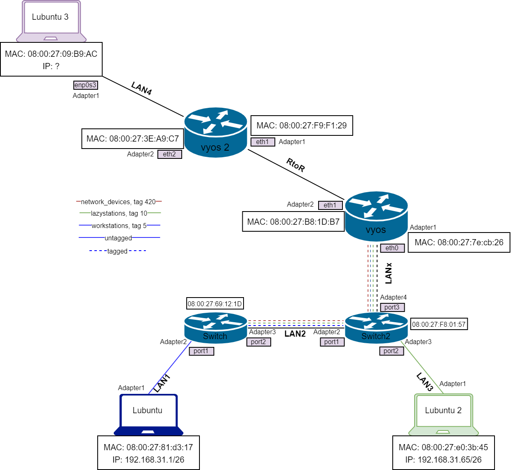
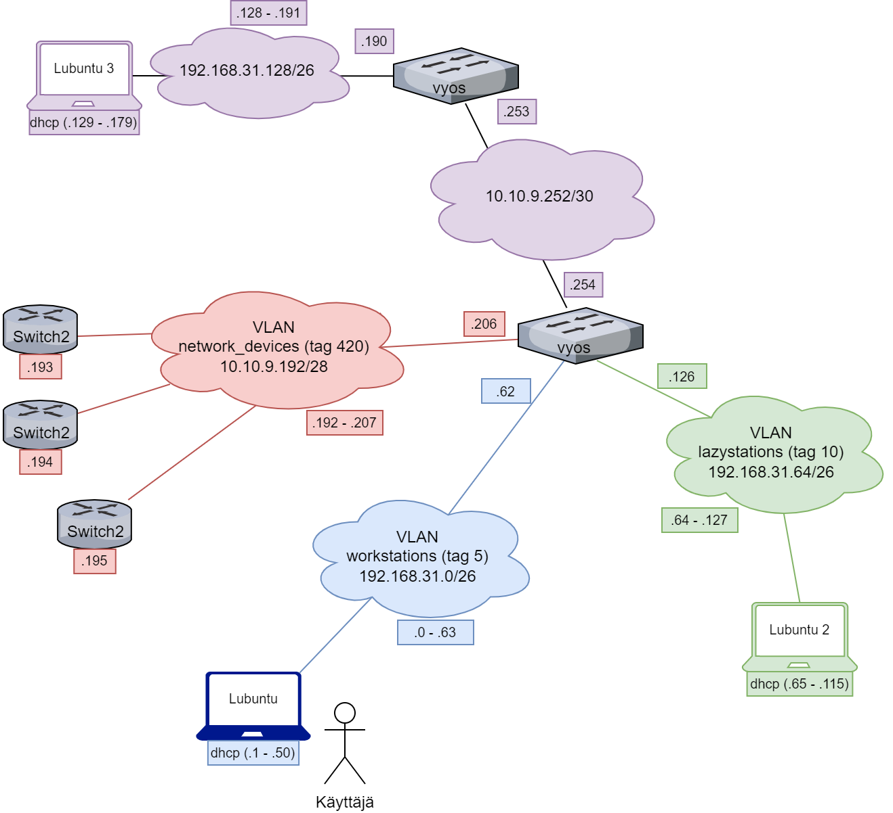
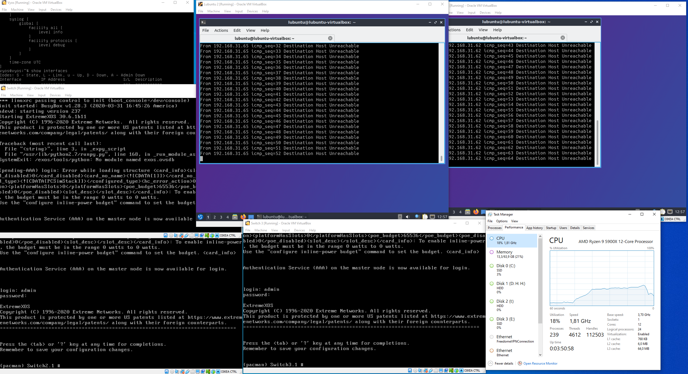
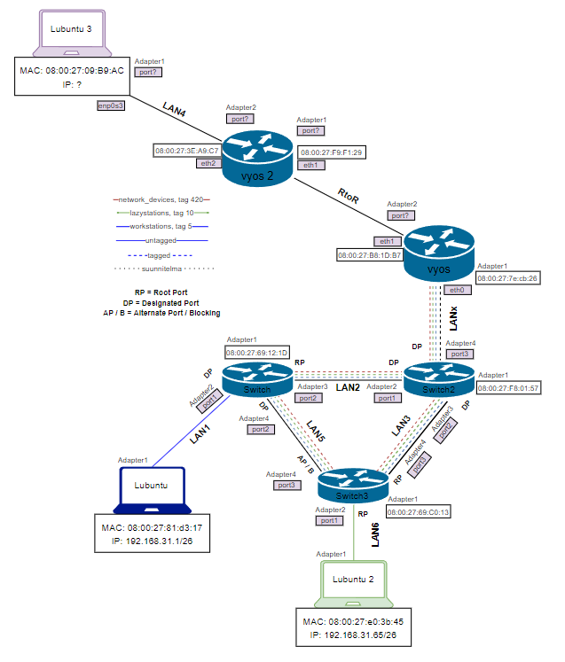

# Dokumentaatio tehtävään E07

Aloitin avaamalla kytkimien configuraatiot ja suunnittelemalla valmiita configuroinnin komentoja kolmannelle kytkimelle, että homma sujuisi itselleni loogisemmin. Samalla mietin vähän vaihe vaiheelta, miten configuroin kytkimiä ja topologioita.

Alapuolella suunnitelma fyysisestä ja loogisesta topologiasta.

Tässä nyt sitä korjattua topologiaa, aikasempi versio oli vääränlainen.

Nonniin, tuli luotua uusi kytkin ja asetettua se tehtävän esimerkin mukaisen topologian mukaisesti. Säädin kytkimien ja lubuntu2 -koneen adaptereita, configuroin kytkimiä ja päivitin fyysistä topologiaa.

Säätöjä tehdessä tein amatöörivirheen. Konfiguroin kaikki kytkimiä yhtäaikaisesti ja jonkin kytkimen kohdalla porttien untagged/tagged -asetuksia säätäessä tuli jokin ilmoitus, jota en tietenkään muistanut lukea riittävän huolellisesti ja ottaa kuvaa talteen, mutta nyt lubuntuille ei tule ip-osoitetta dhcp:n avulla. No, tästä jatketaan ensi kerralla.

Jatkoin tehtävää parin välipäivän jälkeen. En tiedä mitä on välissä tapahtunut, mutta nyt kaikki toimii normaalisti. Lubuntut saa ip-osoitteet ja pystyy pingaamaan normaalisti kaikkkiin koneisiin. Mahtavuutta!

Pingasin koneita ja käynnistelin kytkimet yksitellen, kuten pyydettiin. Sain CPU:n käyttöprosentin nousemaan, pistetäänpäs tästä alapuolelle kuva.

Tästä on nyt hyvä jatkaa sitten niiden spanning-tree-protokollien kanssa.

Jeppistä, päivittelin fyysistä topologiaa niin, että lisäsin kytkimille mac-osoitteet, lisäsin myös porteille merkintöjä (root port, designated port, alternate port) kytkimien configuraatioiden mukaisesti. Tähän alapuolelle linkkaan päivitetyn fyysisen topologian.

Nyt laitan tähän alapuolelle kaikkien laitteiden stpd -komentojen configuraatiot, joita tässä kyseisessä harjoituksessa halutaan.

* [Switch 1 stpd](E07/Switch_stpd.cfg)
* [Switch 2 stpd](E07/Switch_2_stpd.cfg)
* [Switch 3 stpd](E07/Switch_3_stpd.cfg)

### <ins>Kytkimien konfiguraatiot

* [Switch 1](E07/Switch_1_conf.cfg)
* [Switch 2](E07/Switch_2_conf.cfg)
* [Switch 3](E07/Switch_3_conf.cfg)

