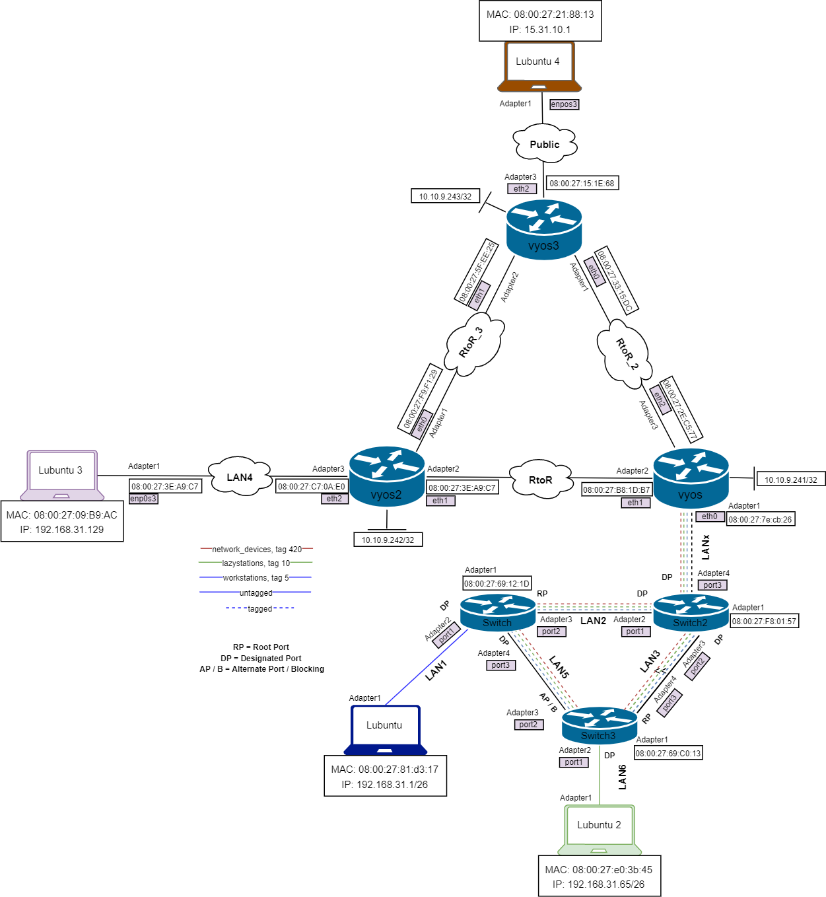
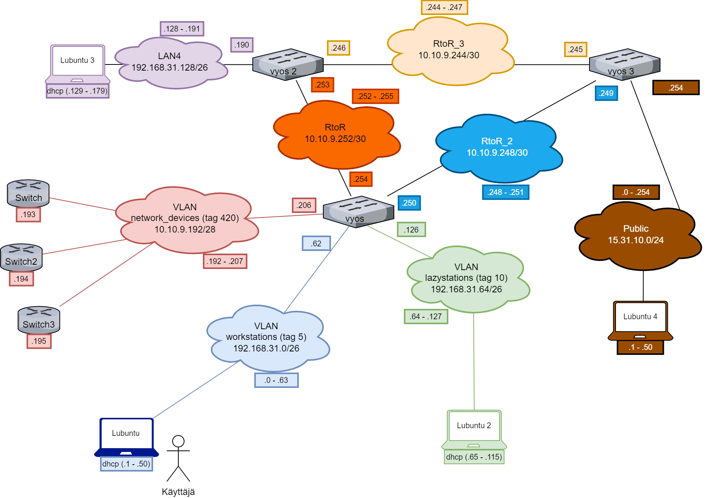
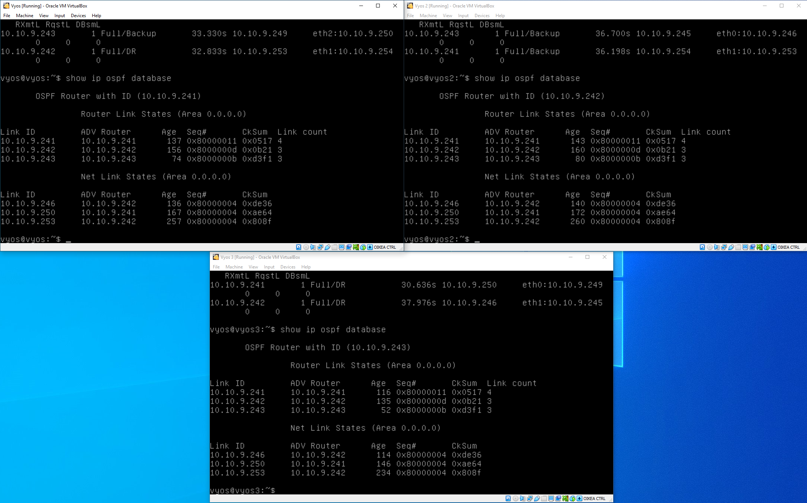
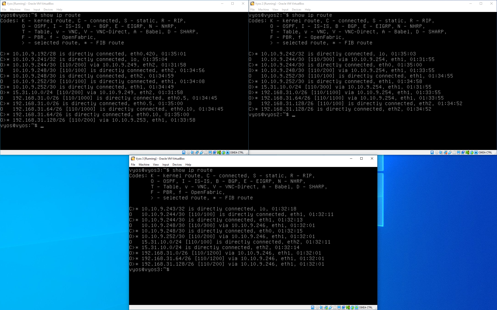
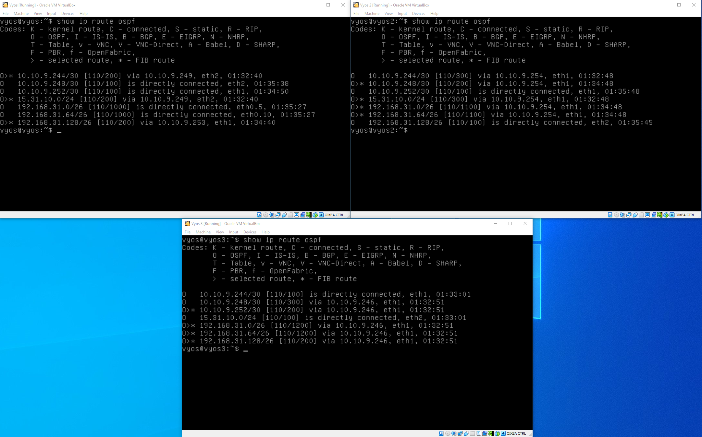

# Dokumentaatio tehtävään E08

## <ins>Johdanto

Nonniin, uuden tehtävän pariin. Aloitetaan laittamalla alapuolelle vyos -laitteiden configuraatiot ja kuvat topologioista:

### <ins>Vyos -configuraatiot</ins>
* [vyos](E08/vyos.cfg)
* [vyos2](E08/vyos2.cfg)
* [vyos3](E08/vyos3.cfg)

## <ins>Topologiat</ins>

### Fyysinen topologia:

### Looginen topologia:

## <ins>Vyoseille annettuja ospf -komentoja:</ins> 

### Vyos 1
~~~
- set protocols ospf parameters router-id 10.10.9.241
- set protocols ospf area 0 network 192.168.31.0/26
- set protocols ospf area 0 network 192.168.31.64/26
- set protocols ospf area 0 network 10.10.9.252/30
- set protocols ospf area 0 network 10.10.9.248/30
~~~
### Vyos 2
~~~
- set protocols ospf parameters router-id 10.10.9.242
- set protocols ospf area 0 network 10.10.9.244/30
- set protocols ospf area 0 network 10.10.9.252/30
- set protocols ospf area 0 network 192.168.31.128/26
~~~
### Vyos 3
~~~
- set protocols ospf parameters router-id 10.10.9.243
- set protocols ospf area 0 network 15.31.10.0/24
- set protocols ospf area 0 network 10.10.9.248/30
- set protocols ospf area 0 network 10.10.9.244/30
~~~

Sitten uusia kuvia pyydetyistä komennoista (päivitetyillä configuraatioilla), jotka ovat:

~~~
- show ip ospf neighbor,
- show ip route ospf ja show ip route ja
- show ip ospf database
~~~

Vasemmalla ylhäällä vyos1, oikealla ylhäällä vyos2 ja keskellä alhaalla vyos3. 

Nyt voi hyvillä mielin mennä eteenpäin harjoituksissa. Voi jukupätkä!