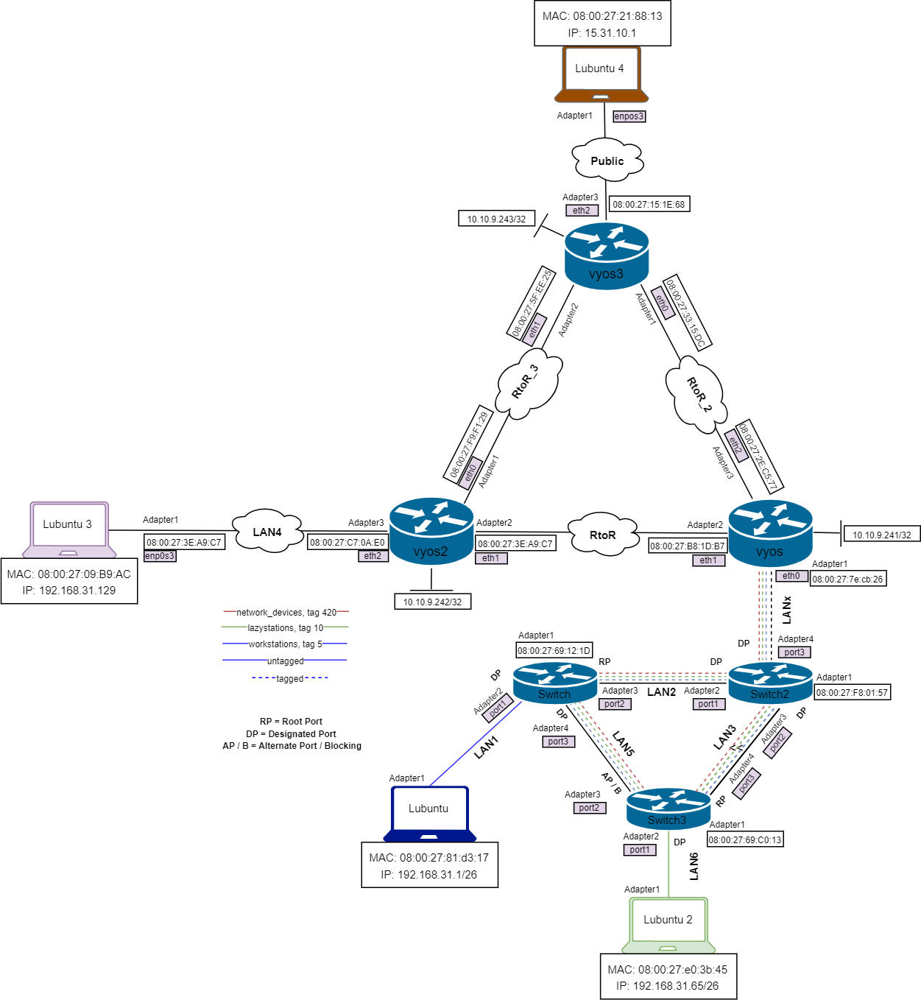
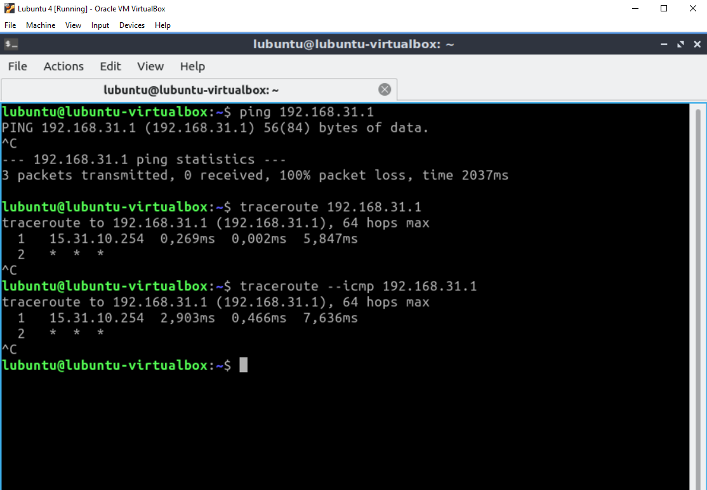

# Dokumentaatio tehtävään E09

## Johdanto

Noniin, vihdoin ja viimein tämän harkan pariin. Jätin tämän harkan aluksi välistä, joten olen aikaisemmin jo tehnyt public -verkon ja virtuaalikoneen sinne. Mutta ennen kuin ruvetaan syöttämään ohjeiden mukaisesti annettuja komentoja vyos3:lle, laitan alapuolelle kuvat sekä topologioista.

### <ins>Fyysinen topologia</ins>

### <ins>Looginen topologia</ins>

## <ins>Vyos palomuurin konfigurointia</ins>

Jotta pingi kulkee globaalisti palomuurin lävitse, annamme tällaisen komennon:

~~~
- set firewall all-ping enable
~~~

### <ins>Luodaan vyöhykkeet (zones)</ins>

Oletuksena (koska sääntötaulut yleensä aina sisältävät oletushylkäyksen) perustamme vyöhykkeet komennoilla:
~~~
- set zone-policy zone LAN default-action drop
- set zone-policy zone WAN default-action drop
- set zone-policy zone vyos default-action drop
~~~
Tämän jälkeen meidän pitää sitoa mikä rajapinta on sidottuna mihinkäkin vyöhykkeeseen. Topologiassa se olisi:
~~~
- set zone-policy zone WAN interface eth2
- set zone-policy zone LAN interface eth1
- set zone-policy zone LAN interface eth0
- set zone-policy zone vyos local-zone
~~~

### <ins>Palomuuri: LAN -> WAN</ins>
~~~
- set firewall name LAN_to_WAN default-action drop
- set firewall name LAN_to_WAN enable-default-log
- set firewall name LAN_to_WAN rule 10 action accept
- set firewall name LAN_to_WAN rule 10 destination port 80
- set firewall name LAN_to_WAN rule 10 protocol tcp
- set firewall name LAN_to_WAN rule 10 log enable
- set firewall name LAN_to_WAN rule 11 action accept
- set firewall name LAN_to_WAN rule 11 destination port 443
- set firewall name LAN_to_WAN rule 11 protocol tcp
- set firewall name LAN_to_WAN rule 11 log enable
- set firewall name LAN_to_WAN rule 20 action accept
- set firewall name LAN_to_WAN rule 20 protocol icmp
- set firewall name LAN_to_WAN rule 20 log enable
- set firewall name LAN_to_WAN rule 30 action accept
- set firewall name LAN_to_WAN rule 30 destination port 22
- set firewall name LAN_to_WAN rule 30 protocol tcp
- set firewall name LAN_to_WAN rule 30 log enable
- set firewall name LAN_to_WAN rule 40 action accept
- set firewall name LAN_to_WAN rule 40 destination port 53
- set firewall name LAN_to_WAN rule 40 protocol udp
- set firewall name LAN_to_WAN rule 40 log enable
~~~

### <ins>Palomuuri: WAN -> LAN</ins>

Tehdään palomuurista tilallinen, joka tarkoittaa sitä, että kaikki liikenne, joka sallitaan LAN -> WAN sallii myös vastaukset takaisin WAN -> LAN.
~~~
- set firewall name WAN_to_LAN default-action drop
- set firewall name WAN_to_LAN rule 10 action accept
- set firewall name WAN_to_LAN rule 10 state established enable
- set firewall name WAN_to_LAN rule 10 state related enable
~~~

### <ins>Palomuuri: LAN -> vyos</ins>

LAN verkot tarvitsevat SSH -yhteyden IP-osoitteisiin, joita vyos virtuaalikone käyttää. Tämä tarkoittaa rajapintojen IP-osoitteita vyos:lla. Myös reititysprotokolla pitää sallia, jotta dynaaminen reititys mahdollistuu.
~~~
- set firewall name LAN_to_vyos default-action drop
- set firewall name LAN_to_vyos rule 10 action accept
- set firewall name LAN_to_vyos rule 10 destination port 22
- set firewall name LAN_to_vyos rule 10 protocol tcp
- set firewall name LAN_to_vyos rule 20 action accept
- set firewall name LAN_to_vyos rule 20 protocol ospf
~~~

### <ins>Palomuuri: vyos -> LAN</ins>

SSH -yhteydet pitää sallia takaisin ulos vyos:lta. Myös reititysprotokolla pitää sallia, jotta dynaaminen reititys mahdollistuu.
~~~
- set firewall name vyos_to_LAN default-action drop
- set firewall name vyos_to_LAN rule 10 action accept
- set firewall name vyos_to_LAN rule 10 state established enable
- set firewall name vyos_to_LAN rule 10 state related enable
- set firewall name vyos_to_LAN rule 20 action accept
- set firewall name vyos_to_LAN rule 20 protocol ospf
~~~

### <ins>Palomuuri: vyos -> WAN</ins>

Tämä viimeinen accept voilla tarpeeton, mutta varmistamaan että muodostetut (eng. established) yhteydet on sallittu takaisin WAN:sta.
~~~
- set firewall name vyos_to_WAN default-action drop
- set firewall name vyos_to_WAN rule 10 action accept
- set firewall name vyos_to_WAN rule 10 state established enable
- set firewall name vyos_to_WAN rule 10 state related enable
~~~

### <ins>Palomuuri: WAN -> vyos</ins>

Jos vyostekee yhteyksiä ulkomaailmaan/WANiin (huom! niitä ei ole sallittu vyos->WAN), me sallimme muodostetut yhteydet takaisin. Haluamme myös sallia ICMP:n, jotta ping toimii WAN:sta ongelmanratkaisua varten.
~~~
- set firewall name WAN_to_vyos default-action drop
- set firewall name WAN_to_vyos rule 10 action accept
- set firewall name WAN_to_vyos rule 10 state established enable
- set firewall name WAN_to_vyos rule 10 state related enable
- set firewall name WAN_to_vyos rule 20 action accept
- set firewall name WAN_to_vyos rule 20 protocol icmp
~~~

### <ins>Lopulta sidotaan sääntötaulut käyttöön vyöhykkeiden välille</ins>

Tämän materiaalin ohjeistus säännöstöstä (toivottavasti) käy järkeen tähän pisteeseen asti. Valitettavasti sääntötaulujen nimeäminen, ja miten ne otetaan käyttöön, näyttää absurdilta seuraavassa komennossa: 
~~~
- set zone-policy zone <destination-zone> from <source-zone> firewall name <source_to_destination>
~~~
Joka on siis topologiassa seuraavasti:
~~~
- set zone-policy zone LAN from WAN firewall name WAN_to_LAN
- set zone-policy zone WAN from LAN firewall name LAN_to_WAN
- set zone-policy zone vyos from LAN firewall name LAN_to_vyos
- set zone-policy zone LAN from vyos firewall name vyos_to_LAN
- set zone-policy zone WAN from vyos firewall name vyos_to_WAN
- set zone-policy zone vyos from WAN firewall name WAN_to_vyos
~~~

### <ins>Vyos3:n configuraatio</ins>

Nyt toivottavasti kaikki konfiguraatiot ovat syötetty oikein, laitetaan alapuolelle vyos3:n konfiguraatio.

* [vyos3](E09/vyos3.cfg)

## <ins>Palomuurin testausta</ins>

Pingaus ja traceroute -komennot tehty seuraavasti:
~~~
- Lubuntu 1 <-> Lubuntu 4 (kumpaankin suuntaan)
- Lubuntu 3 <-> Lubuntu 4 (kumpaankin suuntaan)
~~~

Mielenkiintoinen huomio oli se, sekä pingaus että traceroute -komennot kulkivat samaa aliverkkoa pitkin Public -verkkoon. Liikenne kulkee topologiassani RtoR_2 -verkon kautta. Hämmentävää sinänsä, koska oletin Lubuntu 3:n liikenteen kulkevan Public verkkoon RtoR_3 -verkon kautta.

Laitetaanpas tähän kuvat ping ja traceroute -komennoista:

## <ins>Ping & traceroute -komennot</ins>

### Lubuntu1 -> Lubuntu4

### Lubuntu4 -> Lubuntu1

### Lubuntu3 -> Lubuntu4

### Lubuntu4 -> Lubuntu3

## <ins>Logitiedostojen kuvia</ins>

Seuraavaksi laitetaan kuvia tilanteista, joissa liikenne sekä kulkee, että ei kulje palomuurin läpi. Seuraavissa esimerkeissä pingi kulkee palomuurin läpi, mutta traceroute ei.

### Lubuntu1 -> Lubuntu4 ping
Alapuolella onnistunut pingaus lubuntu1 -> lubuntu4

### Lubuntu1 -> Lubuntu4 traceroute
Alapuolella epäonnistunut traceroute lubuntu1 -> lubuntu4

### Lubuntu3 -> Lubuntu4 ping
Alapuolella onnistunut ping lubuntu1 -> lubuntu4

### Lubuntu3 -> Lubuntu4 traceroute
Alapuolella epäonnistunut traceroute lubuntu3 -> lubuntu4

## <ins>HTTPS</ins>

HTTPS toimii LAN:sta WAN:iin. Laitetaan sekä wget -kuva, että selaimen kautta kuva apachesta.

### wget

### selaimen kautta
