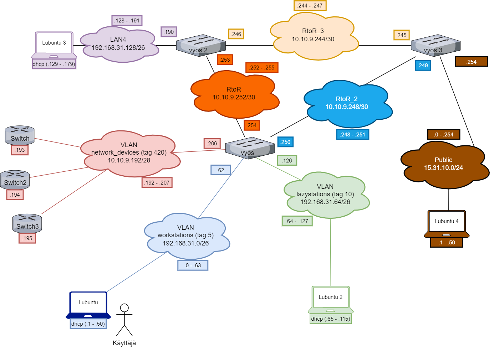

# Dokumentaatio tehtävään E10

### <ins> Johdanto

Aloitellaan perinteisesti sillä, että laitetaan aluksi kuvat topologioista (samat kuin harkassa E08). Tämän jälkeen voimme alkaa kirjoittamaan NAT -komentoja vyos. Kuvien jälkeen laitan configuroinnin komennot.

### <ins>Fyysinen topologia

### <ins>Looginen topologia

### Vyos3 NAT -komennot:
~~~
set nat source rule 10 outbound-interface eth2
set nat source rule 10 source address 0.0.0.0/0
set nat source rule 10 translation address masquerade
~~~

Aluksi en saanut osoitteita natattua, koska en ollut superverkottanut verkkojani oikein. Nyt nattaus toimii, joten laitetaan siitä muutama kuva.

### <ins>Nat source translation

### <ins>Wireshark public -verkon puolelta

### <ins>Wireshark RtoR2 -verkon puolelta

### <ins>Wireshark RtoR3 -verkon puolelta

### <ins>Mietteitä tehtävästä
Suurin ongelma itselläni tehtävässä oli se, etten osannut nat source addressia asettaa oikein. Tämän parissa olin pari päivää jumissa, ennen kuin katselin netistä superverkotuksen laskureita, joiden avulla sai tarkistettua sopivan osoitteen omaan topologiaani sopivaksi. 

Toinen mielenkiintoinen huomio omassa topologiassani on, että liikenne ei kulje julkiseen verkkoon lainkaan RtoR3 -verkon läpi, vaan ainoastaan RtoR2 -verkon läpi. Mutta jokatapauksesa, tästä on hyvä jatkella seuraavaan harkkaan. Voi jukupätkä!

### <ins>Vyos3 -configuraatio 
* [vyos3](E08/vyos3.cfg)