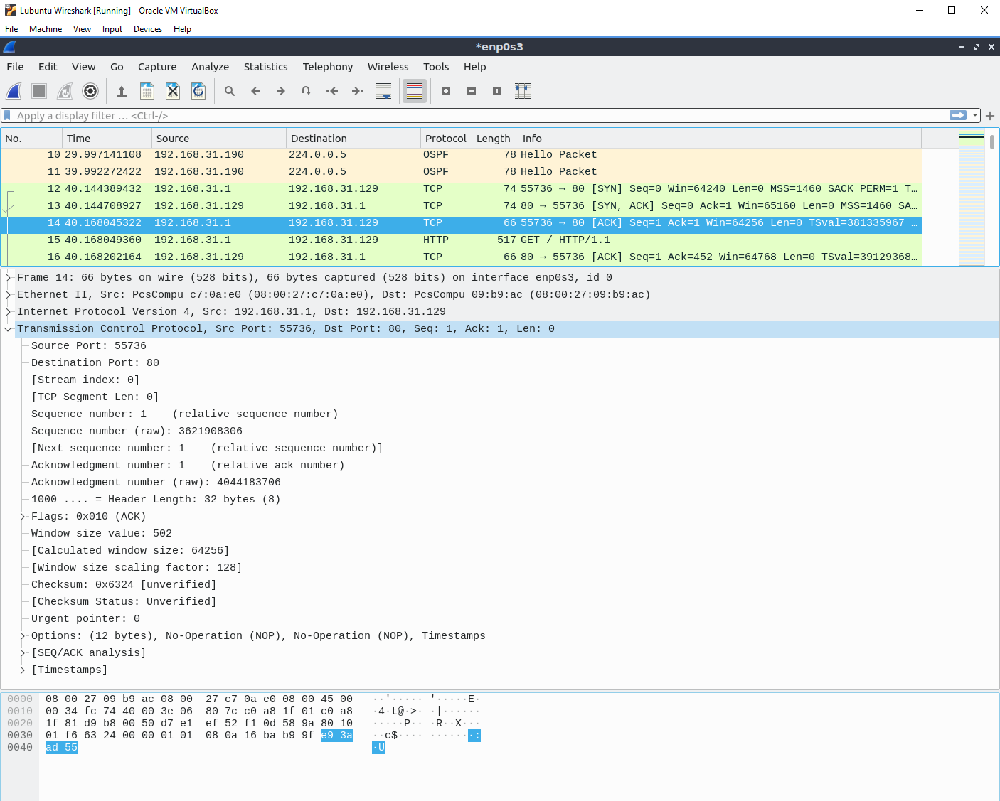

# Dokumentaatio tehtävään E11

## <ins>Johdanto

Jeps, lubuntusta muutettu bridged adapter ja kokeiltu iperf -komentoja. Harjoituksessa pyydetty iperf.he.net ei itselläni toiminut, mutta onneksi listasta löytyis ainakin yksi sopiva. Laitetaanpas alapuolelle parit kuvat näistä. 

### <ins>Iperf -c

### <ins>Iperf -t 10 -i 2 ja iperf -u

sitten kun yritin tehdä toisesta lubuntusta serverin, niin iperf -komento ei toiminut, olipa serveri-lubuntu kytkettynä internal networkiin tai bridged adapteriin.. täytynee huhuilla apuja tähän..

kuva kuitenkin alapuolelle, ennen kuin saan tilanteen korjattua ja siten kuvankin otettua pois.

Noniin, harkassa päästy eteenpäin. Mielenkiintoista oli huomata se, että kun asetin lubuntu3 -aseman serveriksi ja otin yhteyttä lubuntu1 -asemalla, niin yhteyttä ei ALUKSI saatu. Tämä kuitenkin toimi toisinpäin. Hetken päästä "piruuttani" kokeilin vielä kerran alkuperäisellä tavalla ja hups keikkaa, homma toimi. Ei mitään käryä, että miksi näin.. alapuolella parit kuvat eri komennoista serverille yhteydenottamista varten.

## <ins>Wiresharkin käyttö</ins>

Seuraavaksi asetetaan wiresharkia käyttävä lubuntu omassa topologiassa LAN4 -verkkoon kuuntelemaan liikennettä. Tämän jälkeen toinen lubuntu on serverinä ja toisella koneella avataan firefoxin selain ja otetaan selaimen kautta yhteys serviä pitävään koneeseen. Wiresharkilla nähdään tämä kolmivaiheinen kättely, joka on kuvassa riveillä 12-14.

### <ins>Wireshark -kuvankaappaus

### <ins>Kättelynvaiheiden kuvankaappaukset, paketti 1
Alapuolella kuva on kättelyvaiheen ensimmäinen vaihe, jossa asiakaskone muodostaa yhteyttä serveriin.

### Kättelynvaiheiden kuvankaappaukset, paketti 2
Alapuolella kuva on kättelyvaiheen toinen vaihe, jossa serveri kuittaa asiakaskoneelle yhteydenmuodomostamisesta.

### <ins>Kättelynvaiheiden kuvankaappaukset, paketti 2
Alapuolella kuva on kättelyvaiheen kolmas vaihe, jossa asiakaskone kuittaa vielä kerran serverille.

## <ins>DHCP viestit Lubuntun ja Vyos:n välillä</ins>

Sammutin ensimmäisen lubuntun ja aloin nauhoittamaan wiresharkilla ethernet segmenttiä ensimmäisen lubuntun edessä. Ennen kuin lubuntu käynnistyi ja sai yhteyttä dhcp -protokollalta, niin wiresharkissa näkyi enimmikseen hello -paketteja. Yhteyden saatuaan wireshark nappasi kaksi DHCP viestiä, jotka näkyvät kuvassa riveillä 62 ja 63.

### <ins>Wireshark -kuvankaappaus DCHP -viesteistä
Alapuolella ensimmäinen kuva DHCP -protokollan etsinnästä.

### <ins>Wireshark DCHP -paketti 1
Alapuolella kuva ensimmäisestä DHCP -protokollan paketista. DHCP -protokolla huhuilee pyyntöjä, josko kukaan vastaisi hänen pyyntöön.

### <ins>Wireshark DCHP -paketti 2
Alapuolella kuva toisesta DHCP -protokollan paketista. Lubuntu vastaa tähän DHCP:n lähettämään huhuiluun.
