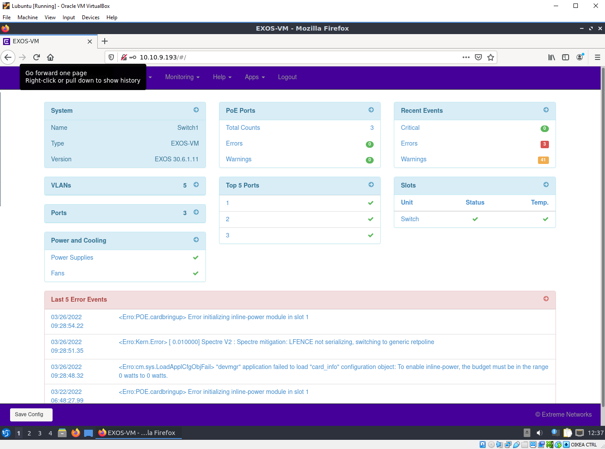
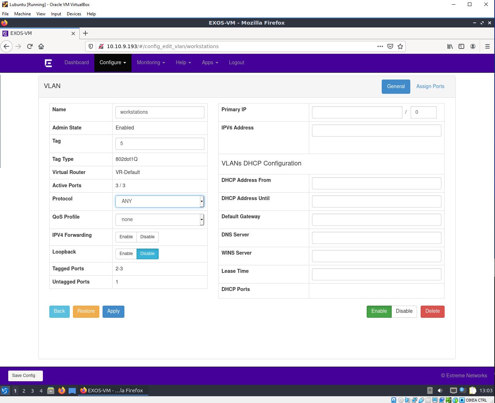
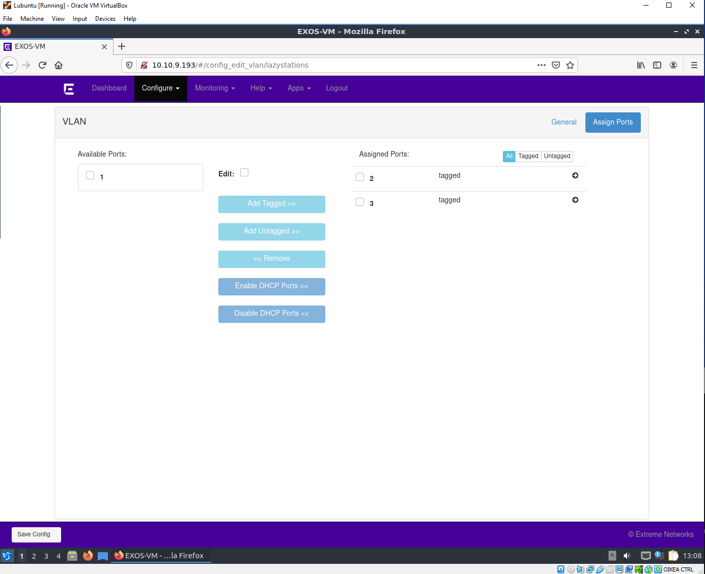
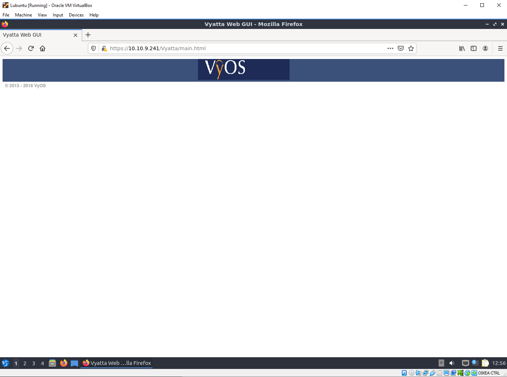

# Dokumentaatio tehtävään E12

Jeps, kytkimien ja reitittimien configuraatiot otettu talteen. Linkkaillaan tähän alapuolelle purkkien konfiguraatioita:

#### <ins>Vyos -laitteiden configuraatiot
* [vyos](E12/vyos.cfg)
* [vyos2](E12/vyos2.cfg)
* [vyos3](E12/vyos3.cfg)

#### <ins>Switch -laitteiden configuraatiot

* [switch](E12/switch.cfg)
* [switch2](E12/switch2.cfg)
* [switch3](E12/switch3.cfg)

### <ins>Testataan HTTP tuki

Enabloin web -palvelimen vyos1 ja switch1 -laitteissa. Käytetään lubuntua yhdistämään laitteiden ip-osoitteisiin, jotka ovat
~~~
- 10.10.9.193 (switch)
- 10.10.9.241 (vyos)
~~~
### "Mitä voit konfiguroida selaimen kautta?"
#### Switchillä:
~~~
- VLAN asetuksia:
    - tagin numero
    - protokolla
    - QoS profiili
    - IPv4 forwarding
    - Loopback (disable/enable)
    - Primary IP
    - IPv6 address
    - DHCP -asetuksia
    - tagged/untagged
~~~

### Vyosilla:
- Ei mitään

