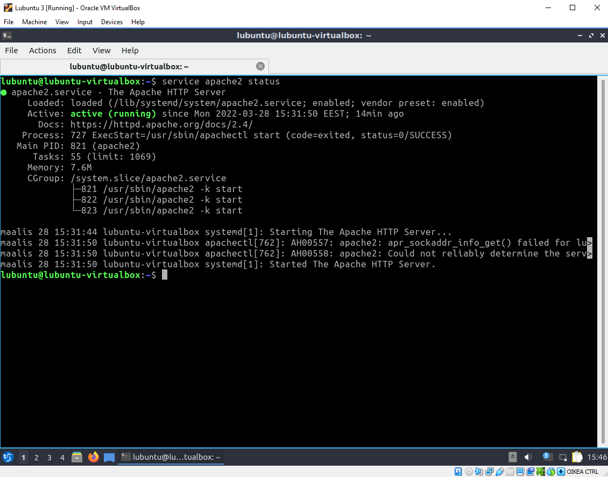
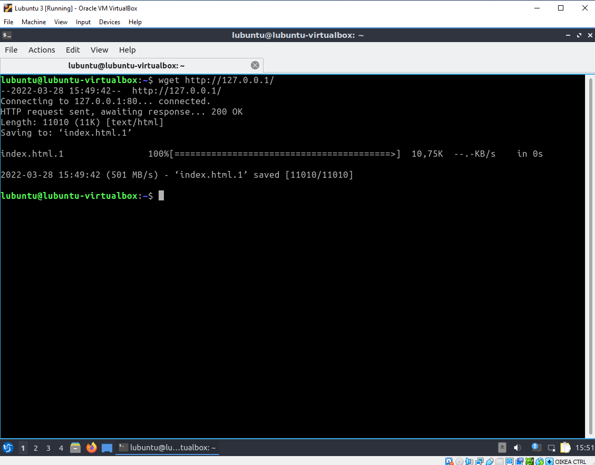
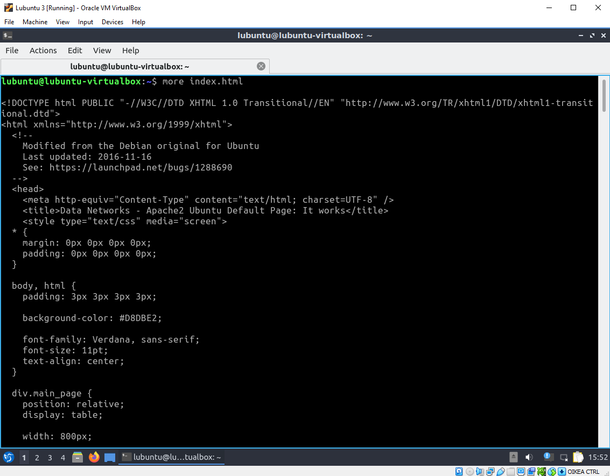
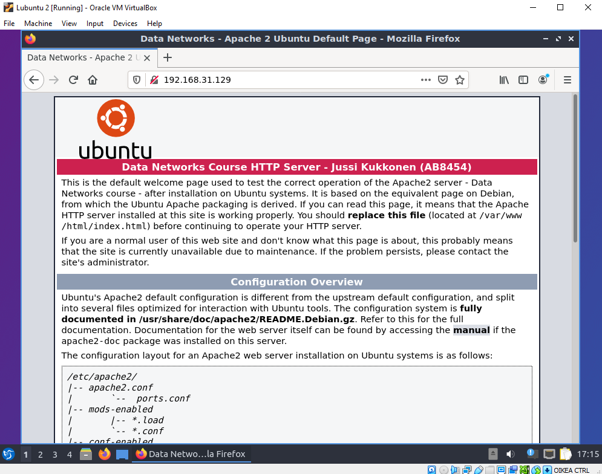

# Dokumentaatio tehtävään E13

Ihan alkuun laitteiden configuraatiot, ennen kuin aloitetaan harkka:
### <ins>Vyos -laitteiden configuraatiot
* [vyos](E13/vyos.cfg)
* [vyos2](E13/vyos2.cfg)
* [vyos3](E13/vyos3.cfg)

### <ins>Switch -laitteiden configuraatiot

* [switch](E13/switch.cfg)
* [switch2](E13/switch2.cfg)
* [switch3](E13/switch3.cfg)

### <ins>Kuvat topologioista

* [fyysinen_topologia](E13/fyysinen_topologia.png)
* [looginen_topologia](E13/looginen_topologia.PNG)

### <ins>Aloitetaan harkka
Nonniin, harkkaa aloiteltu. Kokeillaan aluksi lubuntulla muutamia komentoja ja laitellaan niistä kuvia:

#### <ins>service apache2 status

#### <ins>wget 

#### <ins>more_index 

Homma toimii, voi jukupätkä! Ennen kuin otetaan yhteys asiakaskoneella ja katsotaan mitä tapahtuu, käydään muokkaamassa html -tiedostoa sen verran, että saadaan näkyviin oma nimi ja opiskelijatunnus. Laitetaanpas tästäkin kuva.

#### <ins>apache web

### <ins>WireShark

Seuraavaksi laitetaan wiresharkkia käyttävä Apache Lubuntun läheisyyteen ja seurataan liikennettä. Laitetaan muutamat kuvat alapuolelle.

* [http 1](E13/http_1.PNG "http 1")
* [http 2](E13/http_2.PNG "http 2")
* [http user agent 1](E13/http_user_agent_1.PNG "http user agent 1")
* [http user agent 2](E13/http_user_agent_2.PNG "http user agent 2")