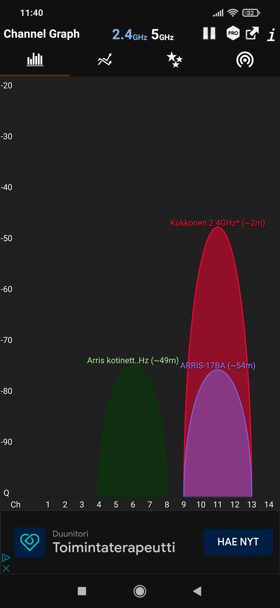
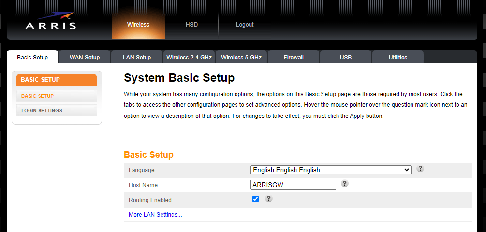
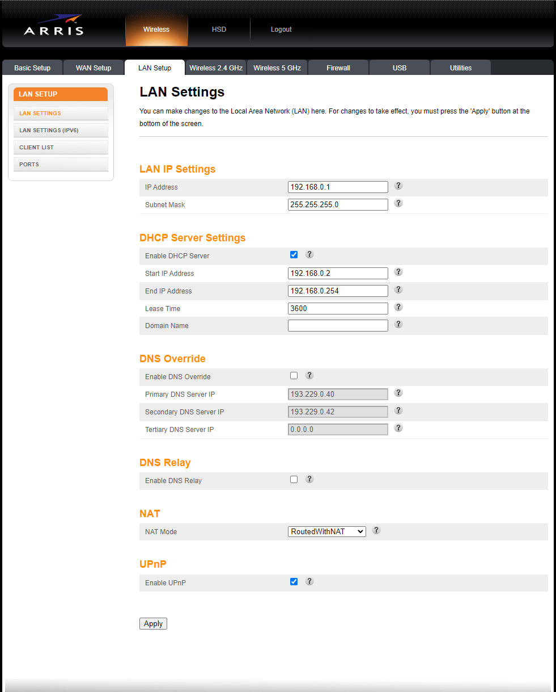

# Dokumentaatio tehtävään E14

## <ins>Johdanto

Laitteiden configuraatiot ja topologioiden kuvat linkattuina alapuolella:

### <ins>Vyos -laitteiden configuraatiot
* [vyos](E14/vyos.cfg)
* [vyos2](E14/vyos2.cfg)
* [vyos3](E14/vyos3.cfg)

### <ins>Switch -laitteiden configuraatiot

* [switch](E14/switch.cfg)
* [switch2](E14/switch2.cfg)
* [switch3](E14/switch3.cfg)

### <ins>Kuvat topologioista

* [fyysinen_topologia](E15/fyysinen_topologia.png)
* [looginen_topologia](E15/looginen_topologia.PNG)

## <ins>Wifi -analyzer</ins>

Jeps, mennään suoraan asiaan. Tutkaillaan Wifi analyzer -sovelluksella omaa WLAN -tukiasemaa. Laitetaan kuva kännykällä otetusta screen shotista tähän dokumenttiin. Kuvasta voidaan todeta, että minun oma tukiasema on noin kahden metrin päässä ja sitten ilmeisesti naapureiden tukiverkot löytyy noin 50 metrin päästä.

1. Käytä WLAN analysaattoria tutkimaan kanavien käyttöasteita

- - -

2. Ota yhteyttä WLAN tukiaseman hallintapaneeliin LAN portin kautta (tai matkapuhelimella)

- Tutki ja selvitä, mikä on oletusyhdyskäytävä laitteille, jotka ovat WLAN:ssa tai LAN:ssa kiinni?
    - **Vastaus:** 192.168.0.1 

- Yritä päästä WLAN tukiasemaasi kiinni käyttämällä HTTP/HTTPS oletusyhdyskäytävän osoitteeseen
    - **Vastaus:** Jeps, onnistuu :)

- Ota selvää mitkä ovat käyttäjätunnukset laitteeseesi (hyvin usein oletussalasanat kyseiselle laitteelle :( )
    - **Vastaus:** Laitteessa merkatut tunnukset toimivat. :)

Laitetaan tähän alapuolelle kuva, että olen päässyt sisään laitteen hallintaan. :)

- - -

3. Tutki hallintapaneelia WLAN tukiasemastasi (tai android/iphone hotspot:sta)

- Mikä kanava? Voiko sitä muuttaa "vapaampaan" kanavaan (perustuen kohdan 1. löydöksiin)?
~~~
Vastaus: kanava 20, ei voi muuttaa :(
~~~
- Mikä on aliverkkosi? Voiko sitä muuttaa?
~~~
Vastaus: Aliverkko on 192.168.0.0/24. Ip-osoitetta ja aliverkon maskia pystyy muuttamaan. 
~~~
- Mikä on DHCP palvelin? Voiko sitä muuttaa/säätää?
~~~
Vastaus: LAN:in DHCP -asetuksia voi säätää. 
~~~

- Mitä muita WLAN asetuksia voidaan säätää? 
    - IPv4: Ip -osoite, aliverkon maski, DHCP -asetukset, DNS, NAT:in moodi, UPnP (on/off) (ks. edellinen kuva!)
    - IPv6: Ip -osoite, aliverkon maski, DHCP -asetukset, DNS [Lan settings IPv6](E14/lan_settings_ipv6.PNG)
    - Ethernet porttien asetuksia heikosti [Ethernet port configuration](E14/lan_settings_ports.PNG)