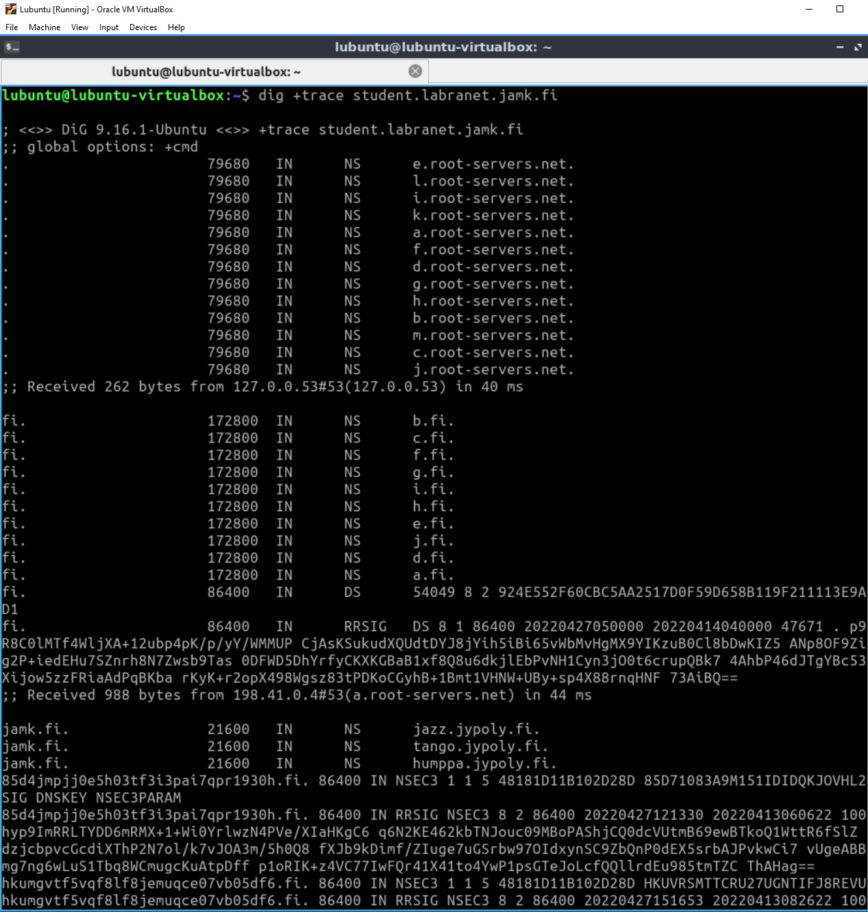
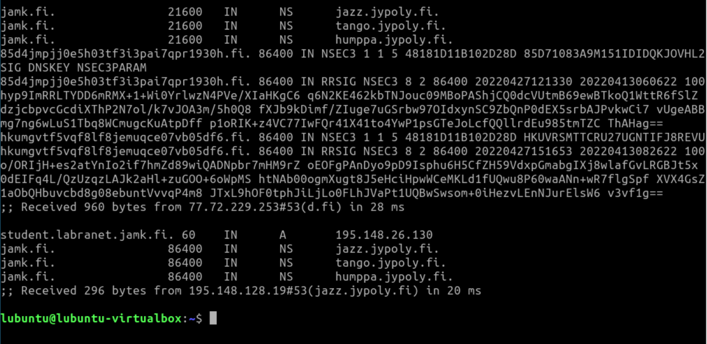
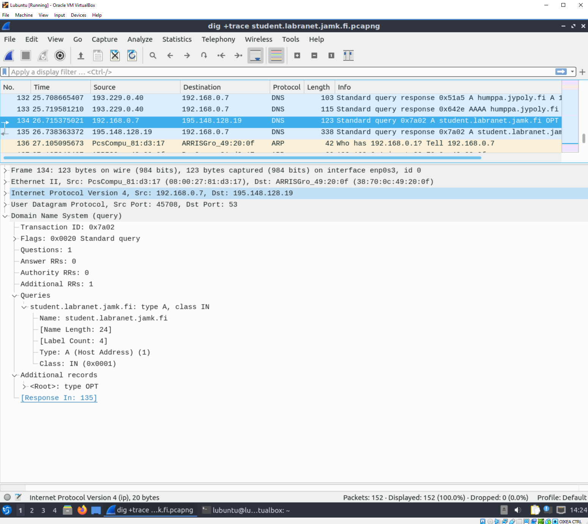
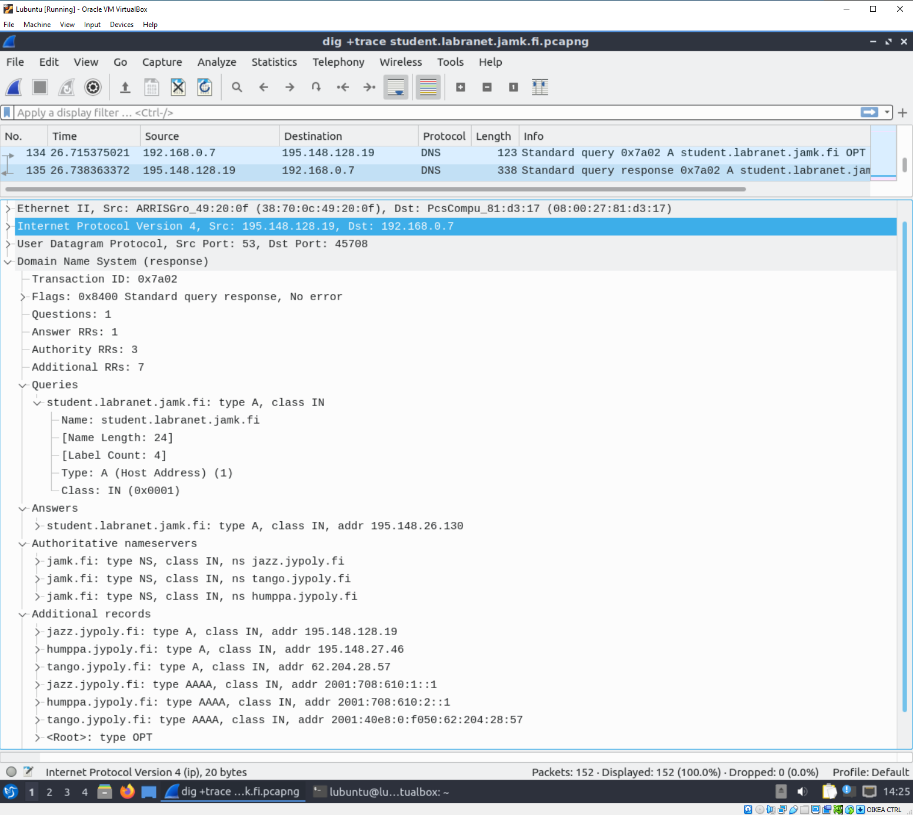
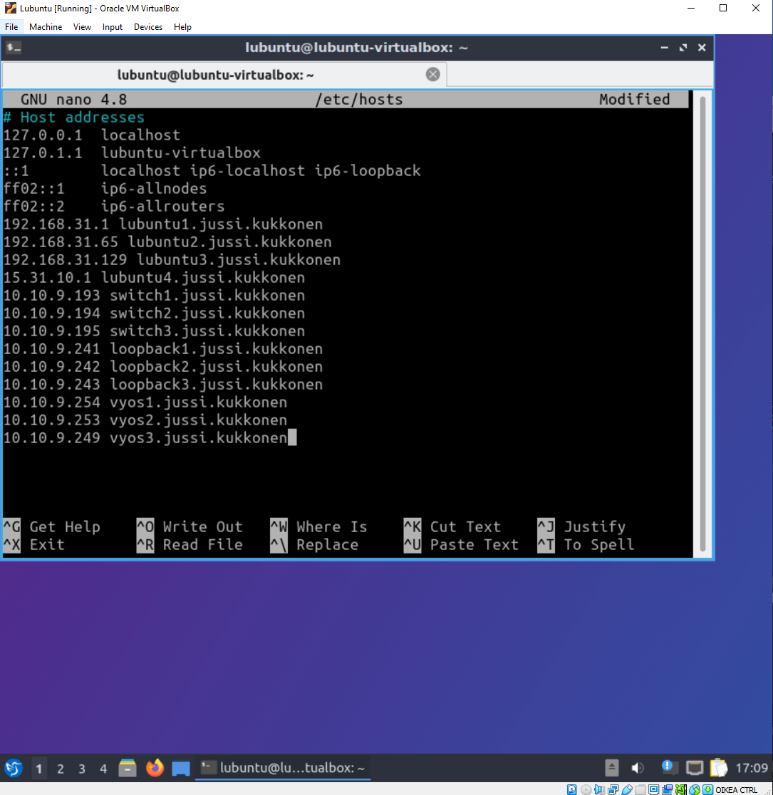
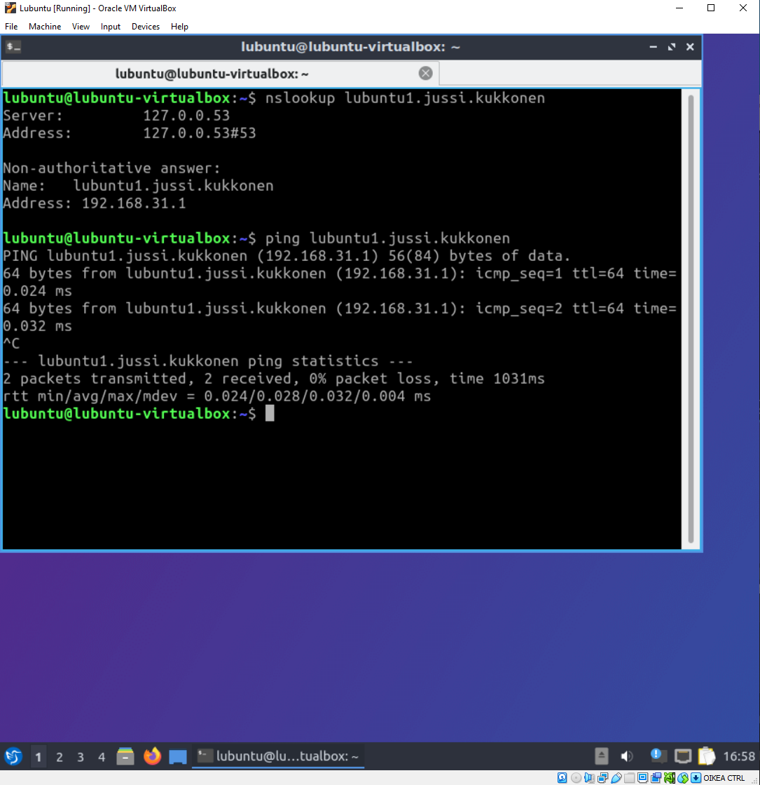
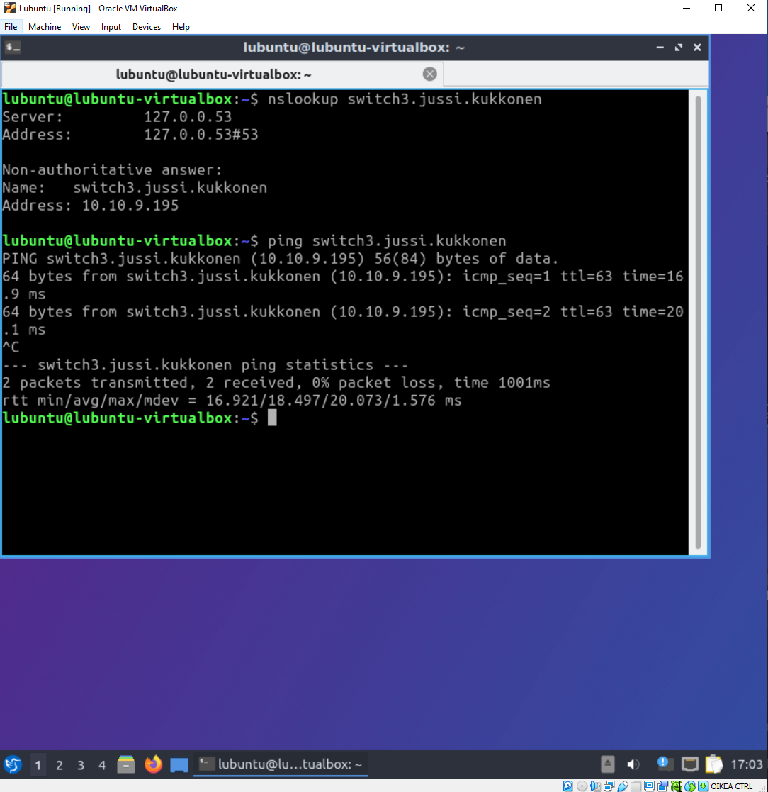

# Dokumentaatio tehtävään E15

## <ins>Johdanto

Laitteiden configuraatiot ja topologioiden kuvat linkattuina alapuolella:

### <ins>Vyos -laitteiden configuraatiot
* [vyos](E15/vyos.cfg)
* [vyos2](E15/vyos2.cfg)
* [vyos3](E15/vyos3.cfg)

### <ins>Switch -laitteiden configuraatiot

* [switch](E15/switch.cfg)
* [switch2](E15/switch2.cfg)
* [switch3](E15/switch3.cfg)

### <ins>Kuvat topologioista

* [fyysinen_topologia](E15/fyysinen_topologia.png)
* [looginen_topologia](E15/looginen_topologia.PNG)

## <ins>Sitten tehtävään

Noniin ja uuden harkan kimppuun. Lubuntu vaihdettu sillattuun rajapintaan, jonka jälkeen lubuntun käynnistyksen jälkeen tehty seuraavaa:
~~~
- käynnistetty wireshark ja laitettu nauhoittamaan liikennettä
- komentokehotteessa käytetty komentoa dig +trace student.labranet.jamk.fi
- pysäytetty wireshark ja tallennettu tuloste
~~~
Laitetaan tästä parit kuvat siis alle:

### <ins>dig +trace student.labranet.jamk.fi</ins>

### <ins>Wiresharkin tutkailua</ins>

Seuraavaksi tutkaillaan wiresharkin tallennetta. Hakutuloksia oli paljon ja mikäli haluat vilkaista koko haun tulokset, ne löytyy kuvina linkattuna alapuolelta. Muussa tapauksessa, ohita linkatut kuvat ja jatka lukemista.

- [Osa 1](E15/dns1.PNG)
- [Osa 2](E15/dns2.PNG)
- [Osa 3](E15/dns3.PNG)

Pakettien tietueita selatessa ilmeni, että ip-osoitteita on huhuiltu kaikkiin haettaviin asioihin, jotka ovat esimerkiksi seuraavat:
~~~
- e.root-servers.net
- c.fi
- jazz.jypoly.fi
~~~

### <ins>Huom!</ins>

Alapuolella listattuna ja linkattuna kaikki ottamani ruudunkaappauskuvat (enemmän kuin tehtävänanto pyytää, hups). Mikäli et haluat katsoa niitä, jatka lukemista.

- [c_1](E15/dns_query_c_1.PNG)
- [c_2](E15/dns_query_c_2.PNG)
- [e_root_1](E15/dns_query_e_root_1.PNG)
- [e_root_2](E15/dns_query_e_root_2.PNG)
- [humppa_1](E15/dns_query_humppa_1.PNG)
- [humppa_2](E15/dns_query_humppa_2.PNG)
- [tango_1](E15/dns_query_tango_1.PNG)
- [tango_2](E15/dns_query_tango_2.PNG)
- [jazz_1](E15/dns_query_jazz_1.PNG)
- [jazz_2](E15/dns_query_jazz_2.PNG)

- - -

### <ins>Student.labranet.jamk.fi</ins>

Haun loppupuolelta löytyy koostettuna student.labranet.jamk.fi -tietueita. Ensimmäisestä kuvasta huomataan, että on sivua on haettu, mutta samalla on haettu nimiservereitä, jotka ovat:

~~~
- jazz.jypoly.fi
- tango.jypoly.fi
- humppa.jypoly.fi
~~~

Näiden hakujen jälkeen on lopussa yhdessä haussa koostettuna kaikki edellä mainitut nimiserverit ja Student.labranet.jamk.fi. Sieltä paljastuu kaksi ip-osoitetta, jotka kummatkin viittaavat osoitteeseen student.labranet.jamk.fi. Ensimmäisessä kuvassa kuvassa destination address on **<ins>195.148.128.19** ja toisessa kuvassa **<ins>195.148.26.130**. Laitetaan alapuolelle täsmentävät kuvat:

Eli ihan tarkalleen en osaa nyt sanoa, mikä osoite on oikea.

## Osio 2

Sitten, kone muutettu takaisin internal networkiin. Lubuntu saa ip-osoitteen, mahtavuutta. Linkataan siitä [kuva](E15/ip_addr_ok.PNG). Seuraavaksi sitten samaisella lubuntulla editoidaan /etc/hosts -tiedostoa, johon laitetaan dataa oman ympäristön purkeista. Laitetaan siitä kuva alapuolelle:

Seuraavaksi sitten aletaan testaamaan, toimivatko nämä äskeiset muokkaukset. Aloitetaan nslookup lubuntu1.jussi.kukkonen -komennolla sekä pingillä:

Voi jukupätkä, sehän toimii! Seuraavaksi kokeillaan sama jollekin kytkimille, vaikka switch3:lle:

Ai jukra, sekin toimii moitteitta! kokeillaan vielä viimeiseksi ottaa ssh -yhteys johonkin kytkimeen ja reitittimeen ja linkataan ne tähän alapuolelle:

- [Switch3](E15/ssh_switch_3.PNG)
- [Vyos2](E15/ssh_vyos_2.PNG)

Kaikki näytti toimivan oikein hyvin. Hirivittävän kiva juttu! Tähän on hyvä lopettaa tämä harkka! :)